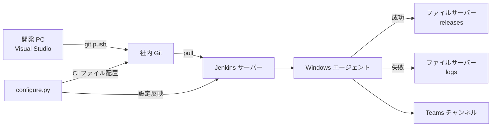
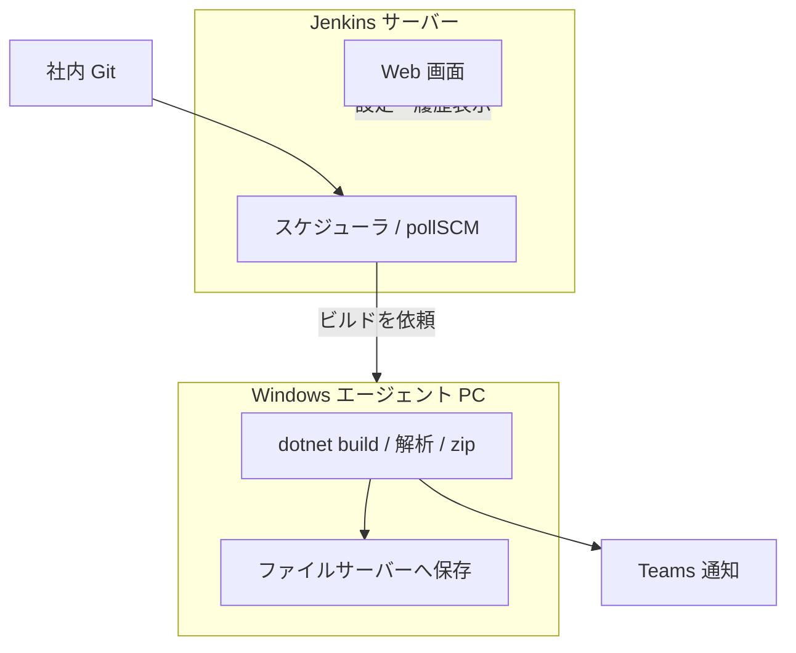

# CISetup CI テンプレート

**設定 GUI:** `configure.py`（Python 3.10+）— `start_configure.bat` で起動

**.NET デスクトップアプリ（WPF / WinForms 等）向け CI キット**

Jenkins が社内 Git から pull → ビルド → Teams 通知 → ファイルサーバー格納まで自動実行します。  
Visual Studio は **開発 PC にだけ** 必要で、CI サーバー・エージェントには **不要** です。

設定作業は **CISetup Configure（Python GUI）** で完結します（かんたん入力、上から順に進めて最後にボタン 1 つ）。

> **初めてセットアップする人は [0-6 完全再現手順](#0-6-完全再現手順ゲート付き--この順番で進めれば再現できます) を上から順に実行してください。**  
> 各ステップに「成功の見え方（ゲート）」があります。**ゲートを通過するまで次に進まない** と、どこで詰まったか特定しやすくなります。

📊 **プレゼン資料（Marp）:** [`docs/CISetup-CI-Guide.marp.md`](CISetup-CI-Guide.marp.md)  
Jenkins 導入・Teams Webhook・アプリ操作をスライド形式で網羅しています。

📖 **GUI 操作:** [`docs/GUI.md`](GUI.md)

---

## 目次

0. [はじめに（初心者向け・用語・事前準備・最短ルート）](#0-はじめに--この手順書だけで-jenkins-導入から完了まで進められます)
   - **[0-6 完全再現手順（ゲート付き）](#0-6-完全再現手順ゲート付き--この順番で進めれば再現できます)** ← **初回はここ**
1. [概要](#1-概要)
2. [必要な環境](#2-必要な環境)
3. [初回構築の全体像](#3-初回構築の全体像)
4. [Phase 1 — ファイルサーバー](#4-phase-1--ファイルサーバー)
5. [Phase 2 — Teams Webhook](#5-phase-2--teams-webhook)
6. [Phase 3 — Jenkins サーバー構築（Windows）](#6-phase-3--jenkins-サーバー構築windows)
7. [Phase 4 — 設定アプリで Jenkins を自動設定](#7-phase-4--設定アプリで-jenkins-を自動設定)
8. [Phase 5 — Windows ビルドエージェント](#8-phase-5--windows-ビルドエージェント)
9. [Phase 6 — プロジェクトごとの CI 設定](#9-phase-6--プロジェクトごとの-ci-設定)
10. [Phase 7 — 将来の LDAP / AD 認証](#10-phase-7--将来の-ldap--ad-認証)
11. [動作確認](#11-動作確認)
12. [日常運用](#12-日常運用)
13. [別プロジェクトで使うとき](#13-別プロジェクトで使うとき)
14. [設定ファイルリファレンス](#14-設定ファイルリファレンス)
15. [トラブルシューティング](#15-トラブルシューティング)
16. [CISetup 本体の開発・ビルド環境](#16-cisetup-configure-の開発配布)
17. [付録 — 初回構築チェックリスト](#17-付録--初回構築チェックリスト)
18. [構築記録シート（コピー用テンプレート）](#18-構築記録シートコピー用テンプレート)

---

## 0. はじめに — この手順書だけで Jenkins 導入から完了まで進められます

> **この章だけ先に読んでください。** Jenkins を触ったことがない人でも、上から順に進めれば
> 「Jenkins 導入 → CI 設定 → 動作確認」まで到達できるように、用語・事前準備・最短ルートをまとめています。

### 0-1. まず「自分の役割」を確認（読む範囲が変わります）

| あなたの状況 | 読む範囲 | 目安時間 |
|--------------|----------|----------|
| 会社で**はじめて Jenkins を立てる**（インフラ担当） | **[0-6 完全再現手順](#0-6-完全再現手順ゲート付き--この順番で進めれば再現できます)** を上から順に | 半日〜1日 |
| **CISetup 設定アプリを改造・配布する** | **[16章](#16-cisetup-configure-の開発配布)** | 30分〜1時間（初回 SDK 導入含む） |
| **すでに Jenkins がある**。自分のプロジェクトを足したいだけ | **9章だけ**（`configure.py` / Setup-Project.bat の①〜⑥） | 15〜30分 |
| とりあえず**自分の PC で試したい**（検証） | 6章（LocalSystem 可）→ 9章 | 1〜2時間 |

> 迷ったら「はじめて立てる」ルートで上から順に。各 Phase の冒頭に「誰がやるか」を書いています。

### 0-2. 用語ミニ辞典（最初に目を通すと迷いません）

| 用語 | ひとことで言うと |
|------|------------------|
| **CI** | コードを push したら自動でビルド・チェックしてくれる仕組み |
| **Jenkins** | その CI を動かす本体（サーバーソフト） |
| **ジョブ / Pipeline** | 「このプロジェクトをこう処理する」という設定のまとまり |
| **ノード / エージェント** | 実際に `dotnet build` などを実行する PC。Jenkins 本体（サーバー）とは別物。詳しくは [8章](#8-phase-5--windows-ビルドエージェントノード) |
| **ラベル (Label)** | ノードに付ける「目印」。Jenkinsfile の `agent { label 'windows' }` と一致するノードだけがビルドを受け取る |
| **built-in ノード** | Jenkins サーバー自身に最初から付いているノード。検証用には使えるが、本番では専用エージェント PC を推奨 |
| **Credentials** | Jenkins に保存する秘密情報（Git パスワードや Teams URL など） |
| **API Token** | アプリ（設定アプリ）が Jenkins を操作するための鍵。Web ログインのパスワードとは別物 |
| **Webhook** | 何か起きた瞬間に相手へ自動通知する仕組み（Teams 通知もこれ） |
| **pollSCM** | Jenkins が定期的に Git を見に行き、変更があればビルドする方式 |
| **cron** | 「毎日0時」など定期実行のスケジュール表記 |
| **UNC パス** | `\\サーバー名\共有名` 形式のネットワーク共有フォルダの住所 |
| **PAT** | Git の「個人アクセストークン」。パスワード代わりの文字列 |
| **成果物 (artifact)** | ビルドで出来上がる .exe や zip などのファイル |
| **静的解析** | コードを動かさずにバグ・危険箇所を機械的に検出すること |

### 0-3. 着手前に用意するもの（自分で / 人に依頼）

| 必要なもの | 入手元 | 自分で？依頼？ |
|------------|--------|----------------|
| Jenkins を入れる Windows PC（管理者権限） | 自部署 | 自分（管理者権限が必要） |
| 共有フォルダ（成果物・ログ置き場） | ファイルサーバー管理者 | **依頼**することが多い |
| Teams チャンネルと Webhook 作成権限 | チームの Teams | 自分 or チーム管理者 |
| Git リポジトリ URL とログイン情報（PAT 推奨） | Git サーバー管理者 | **依頼**することが多い |
| ポート開放（Jenkins / エージェント / 443 outbound） | ネットワーク管理者 | 必要なら**依頼** |

> **依頼文テンプレ（コピペ用）**
> 「CI 用に共有フォルダを1つ作成し、Jenkins エージェントの実行アカウント（例: `.\jenkins`）に書き込み権限を付与してください。パスは `\\サーバー\共有\ci` を想定しています。」
> 「Git リポジトリ `<URL>` に対して、CI 用の読み取り権限を持つアカウント（または PAT）を発行してください。」

### 0-4. 最短ルート（このチェックを上から順に）

> **詳細版は [0-6 完全再現手順](#0-6-完全再現手順ゲート付き--この順番で進めれば再現できます)**（ゲート付き・推奨）。

```
■ サーバー側（はじめてのときだけ・1回）
  □ 1. Java をインストール（6.1）
  □ 2. Jenkins(LTS) を MSI でインストール（6.2〜6.3）
  □ 3. ブラウザで初回セットアップ・管理者ユーザー作成（6.5）
  □ 4. タイムゾーンを Asia/Tokyo に（6.8）
  □ 5. API Token を発行（6.9）
  □ 6. アプリ 設定アプリの⑤で接続テスト→「Jenkins サーバーを初期設定」→起動コマンドをコピー（7章）
  □ 7. エージェント PC に SDK/Git を入れ、起動コマンドを実行→Nodes で Online 確認（8章）
  □ 7b. （本番）WinSW でサービス化→再起動後も Online を確認（8.9章）

■ プロジェクトごと（毎回・アプリだけで完結）
  □ 8. exe ①〜⑤ を入力（フォルダ/Git/Teams/保存先/Jenkins接続）（9章）
  □ 9. exe ⑥「セットアップを実行」（保存→Jenkins反映→Git push）（9章）
  □ 10. テストビルドで Teams 通知・成果物を確認（11章）
```

> 上の各番号は本文の節へのショートカットです。**「すでに Jenkins がある人」は 8〜10（=9章）だけ**で完了します。

### 0-5. つまずいたら

- **ビルドが始まらない・ずっと待機** → ほぼエージェント（ノード）の問題。[8章](#8-phase-5--windows-ビルドエージェントノード) と [エージェント待ちの対処](#ビルドがエージェント待ちのまま進まない) を先に読む。
- **起動コマンドを打ったが Online にならない** → [8.4 ステップ 2](#ステップ-2--エージェント-pc-で起動するここで手間取りやすい)（**2 行に分けて**実行、成功時は `Connected` が出て窓が開いたまま）。
- **本番で常時稼働させたい** → 手動起動が成功してから [8.9 サービス化（WinSW）](#89-windows-サービス化winsw--本番推奨) へ。
- まず各 Phase 内の「こう表示されたらこうする」枠と [15. トラブルシューティング](#15-トラブルシューティング) を確認。
- アプリ側は **「環境チェック → 環境をスキャン」**（不足ソフトの自動判定）、**「接続テスト」「テスト送信」「ファイルサーバー書き込みテスト」** で、どこで詰まっているか切り分けられます。
- それでも解決しないときは、末尾の [クイックリファレンス — 今どこで詰まっている？](#クイックリファレンス--今どこで詰まっている) から該当セクションへ。

### 0-6. 完全再現手順（ゲート付き）— この順番で進めれば再現できます

> **読み方**
> 1. 下の **構築記録シート**（[18章](#18-構築記録シートコピー用テンプレート)）に環境の値を書き込む  
> 2. **STEP 1 から順に** 実行する（飛ばさない）  
> 3. 各 STEP の **ゲート（成功の見え方）** を満たしてから次へ  
> 4. ゲート不通過 → その STEP の「失敗時」を見る（詳細は各 Phase 章へリンク）

**想定構成（本番）**

| マシン | 役割 | 入れるソフト |
|--------|------|-------------|
| `CI-SRV`（例） | Jenkins サーバー | Java 17, Jenkins LTS |
| `CI-BUILD`（例） | ビルドエージェント | Java 11+, .NET SDK 8, Git |
| `FILE-SRV`（例） | ファイルサーバー | 共有フォルダ `\\FILE-SRV\ci` |
| 開発 PC | CISetup 設定アプリ 操作 | 設定アプリのみ（Git があると便利） |

**検証構成（1 台 PC だけ）:** `CI-SRV` と `CI-BUILD` を同じ PC にする。ファイルサーバーはローカル共有 `\\localhost\ci$` でも可（本番は専用共有を推奨）。

---

#### 構築記録シート（先に埋める）

| キー | 記入欄 | 例 |
|------|--------|-----|
| `JENKINS_HOST` | Jenkins のホスト名 or IP | `CI-SRV` |
| `JENKINS_PORT` | HTTP ポート | `8086` |
| `JENKINS_URL` | `http://{HOST}:{PORT}` | `http://CI-SRV:8086` |
| `JENKINS_ADMIN` | Web ログインユーザー | `admin` |
| `JENKINS_API_TOKEN` | API Token（6.9 で発行） | `11abc...` |
| `FILE_SHARE` | 成果物・ログの UNC ルート | `\\FILE-SRV\ci` |
| `AGENT_NAME` | エージェント名（exe 既定） | `windows-agent` |
| `AGENT_WORKDIR` | 作業フォルダ | `C:\Jenkins\workspace` |
| `AGENT_LABEL` | ラベル（迷ったら空欄） | （空欄） |
| `GIT_URL` | リポジトリ URL | `https://git.../MyApp.git` |
| `GIT_BRANCH` | 対象ブランチ | `master` |
| `GIT_USER` / `GIT_PAT` | 認証 | — |
| `TEAMS_WEBHOOK` | Webhook URL | `https://...` |
| `PROJECT_FOLDER` | `.sln` があるフォルダ | `C:\work\MyApp` |
| `JOB_NAME` | Jenkins ジョブ名（自動でも可） | `MyApp-CI` |

---

#### GATE A — インフラ準備

| STEP | 作業 | どこで | ゲート（すべて Yes で次へ） |
|------|------|--------|---------------------------|
| **A-1** | 共有フォルダ作成 + エージェント用ユーザーに書き込み権限 | ファイルサーバー | [4章](#4-phase-1--ファイルサーバー) のゲート通過 |
| **A-2** | Teams Webhook 作成 + PowerShell テスト送信成功 | Teams | [5章](#5-phase-2--teams-webhook) のゲート通過 |
| **A-3** | ネットワーク確認: `CI-BUILD` のブラウザで `JENKINS_URL` が開く | エージェント PC | ログイン画面 or Jenkins トップが表示 |

---

#### GATE B — Jenkins サーバー

| STEP | 作業 | どこで | ゲート |
|------|------|--------|--------|
| **B-1** | Java 17 インストール | Jenkins サーバー | `java -version` → 17.x |
| **B-2** | Jenkins MSI + サービスユーザー `.\jenkins` | Jenkins サーバー | Test Credentials **成功**（[6.3](#63-service-logon-credentials重要)） |
| **B-3** | Web 初回セットアップ（Unlock → プラグイン → admin 作成） | ブラウザ | Jenkins ダッシュボード表示（[6.5](#65-web-初回セットアップ通常フロー)） |
| **B-4** | タイムゾーン `Asia/Tokyo` | Jenkins Web | System 画面で TZ 確認（[6.8](#68-タイムゾーン)） |
| **B-5** | API Token 発行 → 記録シートに記入 | Jenkins Web | Token をコピー済み（[6.9](#69-api-token-の発行cisetup-gui-用)） |
| **B-6** | 設定アプリ **接続テスト** 成功 | 開発 PC | メッセージ「接続に成功」 |
| **B-7** | 設定アプリ **Jenkins サーバーを初期設定** | 開発 PC | ログに `エージェント 'windows-agent' を登録`、起動コマンド表示（[7章](#7-phase-4--設定アプリで-jenkins-を自動設定)） |
| **B-7b** | `RESTART required` が出た場合 | Jenkins サーバー | `Restart-Service Jenkins` 後、B-7 を再実行 |

**B-6 / B-7 の設定アプリ操作（画面どおり）**

1. `start_configure.bat` を起動（または `python configure.py`）
2. **⑤ Jenkins への接続** に `JENKINS_URL` / `JENKINS_ADMIN` / `JENKINS_API_TOKEN` を入力 → **接続テスト**
3. **詳細設定** を開く → エージェントラベルは **空欄のまま**（初回推奨）
4. エージェント名 `windows-agent`、作業フォルダ `C:\Jenkins\workspace` を確認
5. **Jenkins サーバーを初期設定** → **起動コマンドをコピー**

---

#### GATE C — エージェント起動

| STEP | 作業 | どこで | ゲート |
|------|------|--------|--------|
| **C-1** | Java 11+ / .NET SDK 8 / Git インストール | エージェント PC | `java -version` / `dotnet --version` / `git --version` すべて OK |
| **C-2** | `C:\Jenkins\workspace` 作成 | エージェント PC | `Test-Path` → True |
| **C-3** | agent.jar 取得（2 行目の ①） | エージェント PC | `Test-Path C:\Jenkins\agent.jar` → True |
| **C-4** | `java -jar agent.jar ...` 実行（②） | エージェント PC | 画面に `Connected`、**窓は開いたまま**（[8.4 ステップ 2](#ステップ-2--エージェント-pc-で起動するここで手間取りやすい)） |
| **C-5** | Jenkins **Nodes** で Online | ブラウザ | `windows-agent` が **Online**（緑） |
| **C-6** | ファイルサーバー書き込みテスト | 設定アプリ（エージェント PC で実行推奨） | 「書き込み OK」ダイアログ |
| **C-7** | （本番）WinSW サービス化 | エージェント PC | 再起動後も Online（[8.9](#89-windows-サービス化winsw--本番推奨)） |

**C-3 / C-4 のコマンド（記録シートの値に置換）**

```powershell
cd C:\Jenkins
Invoke-WebRequest -Uri "JENKINS_URL/jnlpJars/agent.jar" -OutFile "C:\Jenkins\agent.jar"
java -jar "C:\Jenkins\agent.jar" -url "JENKINS_URL/" -secret <記録シートのsecret> -name "AGENT_NAME" -workDir "AGENT_WORKDIR"
```

---

#### GATE D — プロジェクト CI 設定

| STEP | 作業 | どこで | ゲート |
|------|------|--------|--------|
| **D-1** | 設定アプリ ① プロジェクトフォルダ選択 | 開発 PC | `Jenkinsfile` / `scripts/` がフォルダに配置される |
| **D-2** | 設定アプリ ② Git URL / ブランチ / 認証 | 開発 PC | ブランチ = マージ検知したいブランチ |
| **D-3** | 設定アプリ③ Teams Webhook + **テスト送信** | 開発 PC | Teams にテストカードが届く |
| **D-4** | 設定アプリ ④ 保存先 = `FILE_SHARE` | 開発 PC | プレビューに UNC パス表示 |
| **D-5** | 設定アプリ ⑤ 接続テスト（再確認） | 開発 PC | 成功 |
| **D-6** | 設定アプリ ⑥ **セットアップを実行** | 開発 PC | ダイアログ「セットアップが完了」、Git push 成功（[9章](#9-phase-6--プロジェクトごとの-ci-設定)） |

**D-6 で自動されること**

- `cisetup.config.json` / `cisetup.secrets.local.json` / `Jenkinsfile` 保存
- Jenkins にジョブ・Credentials 登録
- CI ファイルのみ Git commit & push（secrets は含めない）

---

#### GATE E — end-to-end 動作確認（完了の定義）

| STEP | 確認内容 | ゲート（これが全部できたら構築完了） |
|------|---------|-------------------------------------|
| **E-1** | 設定アプリ または Jenkins から **テストビルド** 実行 | Jenkins でビルド **成功**（青） |
| **E-2** | Teams 通知 | 成功カードが届く（プロジェクト名・ビルド番号表示） |
| **E-3** | 成果物 | `FILE_SHARE\{プロジェクト名}\releases\{日付}\*.zip` が存在（zip 作成 ON 時） |
| **E-4** | 静的解析 | `releases` または `analysis` 配下に `analysis-report.html` |
| **E-5** | 手動再実行 | exe「今すぐビルド」でも E-1〜E-2 が再現できる |
| **E-6** | （任意）マージ検知 | 対象ブランチへ push → 5 分以内に自動ビルド（履歴に SCM change） |
| **E-7** | （任意）定期実行 | 翌日 0:00 に Timer 起動（または cron を一時的に近い時刻に変更して確認） |

**E-1 の Jenkins 画面での見え方**

1. Jenkins → ジョブ `JOB_NAME` を開く
2. **Build Now**（または 設定アプリのテストビルド）
3. ビルド番号をクリック → **Console Output**  
   - 先頭に `Running on windows-agent`（または使用ノード名）  
   - 最後に `Finished: SUCCESS`

**失敗時の切り分け（どの GATE か）**

| Console Output の様子 | 戻る STEP |
|----------------------|-----------|
| `Waiting for next available executor` / ラベルエラー | **C-4〜C-5**（エージェント Offline / ラベル） |
| Git clone / authentication failed | **D-2**（Git 認証） |
| `dotnet` not found | **C-1**（SDK 未導入） |
| UNC / Access denied | **A-1** / **C-6**（共有フォルダ権限） |
| Teams / Webhook エラー | **A-2** / **D-3** |

---

## 1. 概要

### 何が自動化されるか

| タイミング | 処理 |
|-----------|------|
| 毎日 0:00（cron 設定可） | 社内 Git から最新ソースを pull してビルド |
| **master / main へマージ（push）時** | pollSCM が変更を検知して自動ビルド（既定 約5分ごとに確認） |
| **手動実行** | CISetup アプリの「今すぐビルド」ボタン、または Jenkins / API から任意に実行 |
| ビルド後（毎回） | **静的解析でバグの可能性を自動検出し、危険度別にレポート化（HTML / Markdown / CSV）** |
| ビルド後（毎回） | **ユニットテスト結果（TRX / サマリ / 失敗ログ）を専用トップレベル `tests/` へ保存（releases/logs と分離）** |
| ビルド後（毎回・ON 時） | **開発環境一式（チェックアウト済みソース）を zip 化して `source/` へ保存（任意・既定 OFF）** |
| ビルド成功時 | zip 成果物をファイルサーバーへ保存、Teams に成功通知 |
| ビルド失敗時 | ログをファイルサーバーへ保存、Teams に失敗通知 |

> ビルドの実行方法（定期 / マージ / 手動）の詳細は [12. 日常運用](#12-日常運用) を参照。  
> 静的解析の仕組み・出力・危険度の基準は [12-1. 静的解析（バグ自動検出）](#12-1-静的解析バグ自動検出) を参照。  
> .NET 以外（FPGA / C・C++ / Python など）で使う方法は [1-1. ビルド種別（.NET / カスタムコマンド）](#1-1-ビルド種別net--カスタムコマンド) を参照。

### 1-1. ビルド種別（.NET / カスタムコマンド）

CISetup の土台（Git pull → ビルド → 解析 → Teams 通知 → ファイルサーバー保存、定期/マージ/手動トリガー）は言語非依存です。ビルド手順だけを切り替えて、.NET 以外のプロジェクトにも使えます。

GUI の「詳細設定 → ビルド種別」で選択します。

| 種別 | 用途 | 各ステップの実行内容 |
|------|------|----------------------|
| **.NET**（既定） | .NET ソリューション | `dotnet restore/build/format/publish` を自動実行。Roslyn 静的解析つき |
| **カスタムコマンド** | FPGA（Vivado 等）・組み込み C/C++・Python など | 各ステップで入力した任意コマンドを PowerShell として実行 |

> **.NET の Release 成果物について**: publish は **framework-dependent**（`*-win-x64.zip`、exe＋DLL のみ）です。**実行 PC 側に対応する .NET ランタイムがインストールされている前提**の運用です（ビルド側に .NET SDK が必要なのと同様）。`publishProject` に指定する csproj は実行アプリ（`OutputType` が `Exe`/`WinExe`）である必要があります。

カスタムコマンドで設定する項目（`cisetup.config.json` の `build` セクション）:

- `buildCommand`（必須）: ビルド。例 `vivado -mode batch -source build.tcl`
- `lintCommand`（任意）: 構文チェック等。例 `verilator --lint-only -Wall src/top.v`。空ならスキップ
- `analyzeCommand`（任意）: 解析。`artifacts/analysis` に出力すればレポート配置・Teams 連携に乗ります。空ならスキップ
- `publishCommand`（任意）: 成果物生成（ビットストリーム等）
- `artifactGlob`: 成果物として zip にまとめるファイル（`;` 区切り）。例 `**/*.bit;reports/*.rpt`

> 各コマンドはエージェントの作業ディレクトリ（リポジトリ直下）で実行され、終了コードが 0 以外だとそのステージは失敗（Teams に失敗通知）になります。Vivado / Quartus などの CLI がエージェント PC の PATH に通っている必要があります。

### システム構成



### 3 種類のアカウント（混同しない）

Jenkins 導入で最も混乱しやすい点です。**別物** として覚えてください。

| 種類 | いつ作る | 用途 | 例 |
|------|---------|------|-----|
| **Windows サービス実行ユーザー** | MSI インストール時 | Jenkins プロセスを OS 上で動かす | `.\jenkins` |
| **Jenkins 管理者ユーザー** | Web 初回セットアップ時 | Jenkins 画面にログイン・設定変更 | `admin` |
| **API Token** | Jenkins ログイン後 | CISetup 設定アプリ が Jenkins API を呼ぶ | `11abc...` |

> MSI の **Service Logon Credentials** に入力するのは **Windows サービス実行ユーザー** です。  
> Jenkins の Web ログインパスワード **ではありません**。

### Jenkins サーバーとエージェント（なぜノードを用意するのか）

Jenkins は **2 つの役割** に分かれています。ここを理解しておくと、ノード周りで迷いにくくなります。

| 役割 | 何をする PC か | 何を担当するか |
|------|---------------|---------------|
| **Jenkins サーバー** | Jenkins をインストールした PC | ジョブのスケジュール管理、Git の変更検知、画面表示、Teams 通知の指示 |
| **エージェント（ノード）** | ビルドを実行する PC（別 PC でも、同じ PC でも可） | `git pull` の実体、`dotnet build`、静的解析、zip 作成、ファイルサーバーへのコピー |



**なぜ分けるのか**

- ビルドは CPU・メモリ・ディスクを大量に使います。サーバー本体でビルドすると Jenkins の画面操作が重くなったり、他のジョブと干渉します。
- .NET SDK や Git、社内ドライバなど **ビルドに必要なソフトはエージェント PC に入れます**。Jenkins サーバーには Java だけで足ります。
- 複数プロジェクトを運用するとき、ラベルで「Windows 用」「FPGA 用」など **ビルド先 PC を振り分け** できます。

**CISetup の既定の動き**

| 設定 | 意味 |
|------|------|
| 詳細設定の **エージェントラベルが空欄**（既定） | Jenkinsfile は `agent any` → **Online の任意のノード** でビルド |
| エージェントラベルに `windows` などを入力 | `agent { label 'windows' }` → **そのラベルを持つノードだけ** がビルドを受け取る |
| exe「Jenkins サーバーを初期設定」 | Jenkins にノードを登録し、**起動コマンド** を表示（ラベルは上の「エージェントラベル」と同じ値が付く） |

> **よくあるつまずき:** Jenkinsfile に `label 'windows'` と書いてあるのに、ノードに `windows` ラベルが付いていない → ビルドがずっと待機します。  
> → [8.5 ラベルの考え方](#85-ラベルlabelの考え方--jenkinsfile-との対応) と [15. トラブルシューティング](#15-トラブルシューティング) を参照。

---

## 2. 必要な環境

### ソフトウェア一覧

| ソフト | インストール先 | バージョン目安 |
|--------|---------------|---------------|
| Java (JDK) | Jenkins サーバー | 17 以上 |
| Java (JRE/JDK) | Windows エージェント | 11 以上 |
| Jenkins LTS | Jenkins サーバー | 2.555.x 等 |
| .NET SDK | Windows エージェント | 8.0 |
| Git for Windows | Windows エージェント / 設定 PC | 最新 |

> **アプリで自動チェックできます:** `configure.py` の上部「環境チェック」→「環境をスキャン」で、この PC の Git / .NET SDK 8 / Java / Jenkins サービスの有無を判定し、未検出のものは入手先リンクを表示します。エージェント PC でも実行すると確実です。アプリで自動化できない準備（Jenkins 本体・共有フォルダ・Teams Webhook・エージェント起動）は同カードの「アプリで自動化できない準備」に手順とリンクをまとめてあります。

> **CISetup Configure を開発・配布する場合**（Jenkins 導入とは別）→ [16章](#16-cisetup-configure-の開発配布)

### ネットワーク要件

- Jenkins サーバー ↔ 社内 Git（HTTPS / SSH）
- Jenkins サーバー ↔ Windows エージェント（JNLP、HTTP ポート）
- Windows エージェント ↔ ファイルサーバー（UNC 書き込み）
- Jenkins / エージェント ↔ Teams Webhook（HTTPS 443 outbound）
- 将来 LDAP 利用時: Jenkins サーバー ↔ AD/LDAP（通常 389 / 636）

---

## 3. 初回構築の全体像

| Phase | 内容 | 担当 |
|-------|------|------|
| 1 | ファイルサーバー共有フォルダ作成 | インフラ |
| 2 | Teams Webhook 作成 | チーム |
| 3 | **Jenkins MSI インストール + Web 初回セットアップ** | インフラ |
| 4 | 設定アプリでプラグイン・エージェント登録 | 設定 PC |
| 5 | エージェント PC セットアップ・起動・**Online 確認** | インフラ |
| 6 | プロジェクトごとの CI 設定（exe ウィザード） | 各 PJ |
| 7 | （将来）LDAP / AD 認証 | インフラ |

> **2 回目以降のプロジェクト** は Phase 6 だけで OK。

---

## 4. Phase 1 — ファイルサーバー

| 誰がやる | いつ |
|---------|------|
| ファイルサーバー管理者（またはインフラ） | GATE A の **STEP A-1** |

### 4.1 手順

1. 共有フォルダを作成（例: `\\fileserver\ci`）
2. **ビルドエージェントの実行ユーザー** に **変更（書き込み）** 権限を付与  
   - 手動起動時: エージェント PC にログオンしているユーザー  
   - サービス化時: `jenkins-agent` 等のサービスユーザー（[8.9.2](#892-事前準備)）
3. 記録シートの `FILE_SHARE` にパスを記入

### 4.2 フォルダ構成（ビルド成功後のイメージ）

```
\\fileserver\ci\
├── MyApp\                          # 成果物・ログ・解析・ソース（プロジェクト配下）
│   ├── releases\20260615\MyApp-42-win-x64.zip
│   ├── analysis\20260615\analysis-report.html
│   ├── logs\20260615\build-42.log
│   └── source\20260615\MyApp-42-src.zip   # 「開発環境一式を zip 保存」ON 時のみ（毎回）
└── tests\                         # ユニットテスト結果は専用トップレベルに分離（毎回保存）
    └── MyApp\20260615\MyApp-42-103000\
        ├── test-results.trx
        ├── test-summary.json
        └── test-failures.log      # 失敗があれば
```

> **開発環境一式の zip 保存（任意）:** ④ のチェックボックス「開発環境一式（pull した最新ソース）を zip 化して保存する」を ON にすると、CI が **チェックアウト済みのソースツリー**を毎回 zip 化し、各書き込み先の `source\[日付]\<プレフィックス>-<ビルド番号>-src.zip` へ格納します。zip からは `.git` / `artifacts` / `bin` / `obj` / `.vs` / `node_modules` / `packages` / `TestResults` / `*.user` を除外します。フォルダ名は詳細設定 →「ソースフォルダ名」(`storage.sourceDir`、既定 `source`) で変更できます。

### 4.3 ゲート（STEP A-1 完了判定）

エージェント PC（またはサービスユーザー）で PowerShell を開き:

```powershell
$share = "\\fileserver\ci"   # 記録シートの FILE_SHARE
$test = Join-Path $share "cisetup-write-test.txt"
"ok" | Set-Content -Path $test -Encoding UTF8
Remove-Item $test -Force
Write-Host "GATE A-1 OK"
```

| 結果 | 意味 |
|------|------|
| `GATE A-1 OK` と表示 | 書き込み権限 OK → STEP A-2 へ |
| `Access is denied` 等 | 権限不足 → 管理者に依頼（[0-3 依頼文テンプレ](#0-3-着手前に用意するもの自分で--人に依頼)） |

> 設定アプリの **「ファイルサーバー書き込みテスト」**（詳細設定内）でも同じ確認ができます。**エージェント PC 上で** 実行してください。

---

## 5. Phase 2 — Teams Webhook

| 誰がやる | いつ |
|---------|------|
| チーム（チャンネル管理者） | GATE A の **STEP A-2** |

### 5.1 手順（Teams 画面）

1. 通知を送りたい **Teams チャンネル** を開く
2. チャンネル名の横 **「…」** → **ワークフロー**（または **コネクタ**）
3. **「Webhook アラートをチャネルに送信する」**（または類似の Incoming Webhook テンプレート）を追加
4. フロー名を入力（例: `CISetup CI`）→ 作成
5. 表示された **Webhook URL** をコピー → 記録シートの `TEAMS_WEBHOOK` に貼る  
   **Git やメールに平文で流さない**（秘密情報）

### 5.2 ゲート（STEP A-2 完了判定）

PowerShell（どの PC でも可）:

```powershell
$url = "ここに Webhook URL"   # 記録シートの TEAMS_WEBHOOK
$body = '{"title":"CI テスト","text":"Webhook 動作確認です（CISetup GATE A-2）"}'
Invoke-RestMethod -Uri $url -Method Post -Body $body -ContentType "application/json; charset=utf-8"
Write-Host "GATE A-2 OK"
```

| 結果 | 意味 |
|------|------|
| エラーなく完了 + Teams にメッセージ表示 | GATE A-2 通過 |
| 401 / 403 | URL 誤り or フロー無効 → Teams で Webhook を再作成 |
| ネットワークエラー | プロキシ / 443 outbound を確認 |

> exe ③ の **「テスト送信」** でも同様の確認ができます（Adaptive Card 形式）。

---

## 6. Phase 3 — Jenkins サーバー構築（Windows）

> **完全再現:** [0-6 GATE B](#gate-b--jenkins-サーバー)（STEP B-1〜B-7）に対応。以下は詳細説明です。

対象: **Jenkins 2.555.x LTS / Windows MSI インストーラ**

### 6.1 Java 17 のインストール

```powershell
java -version
# openjdk version "17.x.x" が表示されれば OK
```

[JAdoptium Temurin 17](https://adoptium.net/) をインストールし、`JAVA_HOME` を設定します。

---

### 6.2 MSI インストーラの実行

1. [Jenkins 公式](https://www.jenkins.io/download/) から **Windows (LTS)** MSI をダウンロード
2. インストーラを **管理者として実行**
3. インストール先・サービス名はデフォルトで OK（後からポート変更可）
4. **Service Logon Credentials** 画面が表示される → [6.3](#63-service-logon-credentials重要) へ

---

### 6.3 Service Logon Credentials（重要）

#### この画面で設定するもの

| 項目 | 内容 |
|------|------|
| **Logon Type** | Jenkins Windows **サービス** をどの OS ユーザーで動かすか |
| **Account / Password** | その **Windows ユーザー** の資格情報 |
| **Test Credentials** | 上記がサービス起動可能か検証 |

#### ここで設定しないもの

- Jenkins Web 画面の `admin` パスワード
- LDAP / AD アカウント
- API Token

Jenkins 管理者ユーザーは、**サービス起動後の Web 初回セットアップ**（[6.5](#65-web-初回セットアップ通常フロー)）で作成します。

---

#### 推奨: Jenkins 専用ローカルユーザーを作る

管理者 PowerShell:

```powershell
# パスワードを入力（Windows Hello PIN ではなくアカウントパスワード）
$password = Read-Host "jenkins ユーザーのパスワード" -AsSecureString
New-LocalUser -Name "jenkins" -Password $password -FullName "Jenkins Service User" -PasswordNeverExpires
Add-LocalGroupMember -Group "Users" -Member "jenkins"
```

MSI インストーラに入力:

| 項目 | 値 |
|------|-----|
| Logon Type | **Run service as local or domain user** |
| Account | `.\jenkins` |
| Password | 上で設定したパスワード |

→ **Test Credentials** をクリック → **成功** することを確認してから Next。

---

#### 「サービスとしてログオン」権限を付与

Test Credentials で次のエラーが出る場合:

```
Invalid Logon
This account either does not have the privilege to logon as a service
or the account was unable to be verified.
```

**意味:** 指定ユーザーに **Log on as a service（サービスとしてログオン）** 権限がない。

**手順:**

1. `Win + R` → `secpol.msc`（ローカルセキュリティポリシー）
2. **ローカル ポリシー** → **ユーザー権利の割り当て**
3. **サービスとしてログオン** をダブルクリック
4. **追加** → `jenkins`（または使用するアカウント）を追加
5. OK → インストーラに戻り **Test Credentials** を再実行

---

#### エラー: 0x8007052e（Error logging on）

**意味:** Windows ユーザー名またはパスワードが間違っている。

| 確認 | 内容 |
|------|------|
| ユーザー名 | ローカルユーザーは `.\jenkins` 形式 |
| パスワード | **Windows アカウントのパスワード**（PIN 不可） |
| アカウント | ロックアウト・期限切れでないか |

---

#### 検証環境のみ: LocalSystem（非推奨）

| 項目 | 内容 |
|------|------|
| 選択肢 | **Run service as LocalSystem (not recommended)** |
| メリット | 権限エラーで詰まらずインストールを進めやすい |
| デメリット | 権限が強すぎる / UNC 共有アクセスで問題が出やすい |
| 用途 | **ローカル検証のみ**。本番・社内運用では専用サービスアカウント推奨 |

---

### 6.4 JENKINS_HOME の場所

Windows MSI 版で一般的なパス:

| パス | 内容 |
|------|------|
| `C:\ProgramData\Jenkins\.jenkins\` | **JENKINS_HOME**（設定・ジョブ・ユーザー） |
| `C:\ProgramData\Jenkins\` | インストール関連 |

ここに以下が保存されます:

- ジョブ設定 / ビルド履歴
- プラグイン
- ユーザー / 認証設定（LDAP 含む）
- Credentials

---

### 6.5 Web 初回セットアップ（通常フロー）

Jenkins サービス起動後:

1. ブラウザで `http://localhost:8080/` を開く（ポート変更時は [6.10](#610-ポート番号の変更例-8086)）
2. **Unlock Jenkins** 画面が表示される
3. 初期 Admin パスワードを入力:

```powershell
Get-Content "C:\ProgramData\Jenkins\.jenkins\secrets\initialAdminPassword"
```

4. **Install suggested plugins**（推奨プラグイン）
5. **Create First Admin User** — Jenkins 管理者を作成（ユーザー名・パスワードをメモ）
6. **Jenkins URL** を設定（例: `http://jenkins-server:8086/`）
7. **Start using Jenkins**

> ここで作る `admin` が **Jenkins Web ログイン用** です。  
> Windows サービスユーザー `.\jenkins` とは別物です。

---

### 6.6 「サインイン」しか出ない場合

**Unlock Jenkins** や **Create First Admin User** が出ず、**サインイン（Sign in）** だけの場合:

| 原因 | 説明 |
|------|------|
| 初回セットアップ済み | 過去にセットアップが完了している |
| JENKINS_HOME が残っている | 再インストール・上書きインストールでデータが引き継がれた |

**確認:**

```powershell
Test-Path "C:\ProgramData\Jenkins\.jenkins\config.xml"
Get-Content "C:\ProgramData\Jenkins\.jenkins\config.xml" | Select-String "useSecurity"
```

`useSecurity` が `true` なら、セキュリティ有効＝初回セットアップ済みの可能性が高いです。

**対処（優先順）:**

1. **既存の Jenkins 管理者パスワード** でサインインを試す
2. パスワード不明 → [15. トラブルシューティング](#15-トラブルシューティング) の「Jenkins パスワードを忘れた」
3. **検証環境** でデータ消去 OK → [6.7 JENKINS_HOME 退避](#67-jenkins_home-退避初回セットアップに戻す検証環境のみ)

---

### 6.7 JENKINS_HOME 退避（初回セットアップに戻す・検証環境のみ）

> **警告:** 本番・社内共有 Jenkins では **絶対に実行しない** こと。  
> ジョブ・履歴・Credentials・LDAP 設定がすべて失われます。

```powershell
Stop-Service Jenkins

$backup = ".jenkins.bak_$(Get-Date -Format 'yyyyMMdd_HHmmss')"
Rename-Item "C:\ProgramData\Jenkins\.jenkins" $backup

Start-Service Jenkins
```

ブラウザで `http://localhost:8080/`（または使用中ポート）を開き、**Unlock Jenkins** が表示されるか確認。

---

### 6.8 タイムゾーン

**Manage Jenkins** → **System** → タイムゾーン `Asia/Tokyo`

cron `0 0 * * *`（毎日 0:00）は Jenkins サーバーの TZ に従います。

---

### 6.8b cron（定期実行）失敗時の自動リトライ

Git サーバーの瞬断（例: `Empty reply from server`）やネットワーク一時障害で定期ビルドが
失敗することがあります。CISetup では2段構えで自動リトライできます。

1. **Checkout ステージのリトライ（既定で有効）**
   Jenkinsfile 内の `checkout scm` は `retry(N)` でラップされており、パイプライン開始後の
   一時的な Git 取得失敗は自動で再試行されます（既定 3 回、⑧ CI ジョブの詳細で変更可）。

2. **Jenkinsfile 取得自体の失敗に対応（任意・要 Naginator + Parameterized Trigger プラグイン）**
   Jenkinsfile 自体を SCM から取得する段階（Pipeline 開始前）で失敗した場合、上記の
   `retry()` は効きません。Pipeline ジョブは Naginator の失敗時リトライにも対応していないため、
   CISetup で「cron 失敗時に自動リトライする」を有効にすると、cron は本体ジョブではなく
   別建ての軽量ジョブ（`<ジョブ名>-trigger`）に持たせ、そこから本体ジョブを起動・待機します。
   本体ジョブが失敗すればこの trigger ジョブごと失敗になり、Naginator が指定回数・間隔で
   trigger ジョブを再実行 → 本体ジョブを再度起動、という流れで Jenkinsfile 取得失敗も含めて
   救えます。

   - 有効化すると本体 Jenkinsfile の cron トリガーは自動的に無効化されます（pollSCM は従来通り）
   - 「②Jenkins に反映」を実行すると、Naginator / Parameterized Trigger が未導入なら自動インストールされます
   - 無効化しても既存の `<ジョブ名>-trigger` ジョブは自動削除されません。不要な場合は Jenkins で手動削除してください

---

### 6.9 API Token の発行（CISetup 設定アプリ 用）

1. Jenkins に **管理者** でログイン
2. 右上 **ユーザー名** → **Configure**
3. **API Token** → **Add new Token** → 生成 → **コピー**（再表示不可）

設定アプリの **⑤ Jenkins への接続** に入力:

| 項目 | 例 |
|------|-----|
| Jenkins URL | `http://localhost:8086` |
| ユーザー名 | `admin` |
| API Token | 発行した Token |

> **「Jenkins URL」ってどの画面の URL?**
>
> Jenkins に **ログインした直後のホーム画面（ダッシュボード）** を開いた状態で、**ブラウザのアドレスバー** に出ている URL です。
> ホーム画面とは、左に「新規ジョブ作成」、右に「ビルド実行状態」、上部に「Jenkins の管理（Manage Jenkins）」などが並ぶ **トップページ** のこと。
> （どこにいるか分からなくなったら、**画面左上の「Jenkins」ロゴをクリック** すればホーム画面に戻れます。そのときの URL が正解です。）
>
> | 見る場所 | アドレスバーの例 | 補足 |
> |----------|------------------|------|
> | ホーム画面（ダッシュボード） | `http://CI-SRV:8086/` | これが入力する値。サーバー上で操作中なら `http://localhost:8086/` |
> | ジョブを開いた画面 | `http://CI-SRV:8086/job/MyApp-CI/` | **`/job/...` 以降は入れない**（トップだけ） |
> | **Manage Jenkins → System** の「Jenkins URL」 | `http://CI-SRV:8086/` | Jenkins 自身が認識している URL。ここと揃えるのが確実 |
> | エージェント起動コマンドの `-url` | `http://CI-SRV:8086/` | [GATE C](#gate-c--エージェント起動) のコマンドと同じ |
>
> - `localhost` は **その PC 自身** を指します。設定アプリを別 PC（開発 PC）で動かす場合は `localhost` ではなく **ホスト名/IP**（例: `http://CI-SRV:8086`）を入れます。

---

### 6.10 ポート番号の変更（例: 8086）

8080 が他ソフトと競合する場合:

1. Jenkins サービスを停止
2. `C:\Program Files\Jenkins\jenkins.xml` を編集
3. `<arguments>` 内の `--httpPort=8080` を `--httpPort=8086` に変更
4. サービス再起動
5. **Manage Jenkins → System** の Jenkins URL も `:8086` に更新
6. exe・エージェント起動コマンドの URL も **すべて 8086 に統一**

---

### 6.11 Jenkins が起動しない — config.xml エラー

次のエラーで Jenkins が起動しない場合:

```
CannotResolveClassException: hudson.security.GlobalMatrixAuthorizationStrategy
Unable to read C:\ProgramData\Jenkins\.jenkins\config.xml
```

**原因:** Matrix Authorization プラグイン未インストールなのに config.xml に Matrix 権限設定が残っている。

**復旧:**

```powershell
Stop-Service Jenkins
Copy-Item "C:\ProgramData\Jenkins\.jenkins\config.xml" "C:\ProgramData\Jenkins\.jenkins\config.xml.bak"
```

`config.xml` の `<authorizationStrategy>...</authorizationStrategy>` を以下に置換:

```xml
<authorizationStrategy class="hudson.security.FullControlOnceLoggedInAuthorizationStrategy">
  <denyAnonymousReadAccess>true</denyAnonymousReadAccess>
</authorizationStrategy>
```

```powershell
Start-Service Jenkins
```

起動後、**Manage Jenkins → Plugins** で **Matrix Authorization Strategy** をインストールし、Security 画面で権限を再設定。

---

### 6.12 Script Console 権限

CISetup 設定アプリ の「Jenkins サーバーを初期設定」は Groovy（`scriptText`）を使います。

- 使用ユーザー（通常 `admin`）に **Overall/Administer** または **Overall/RunScripts** があること
- **Manage Jenkins → In-process Script Approval** に未承認があれば Approve

---

## 7. Phase 4 — 設定アプリで Jenkins を自動設定

> **完全再現:** [0-6 GATE B](#gate-b--jenkins-サーバー) の **STEP B-6〜B-7**。

Jenkins Web 初回セットアップ（Phase 3）完了後に実施。

### 7.1 設定アプリの起動

```
start_configure.bat
```

または `python configure.py`

かんたん入力 — **上から順** に進め、最後に「セットアップを実行」を押します。

### 7.2 操作手順（Jenkins 基盤の初回設定）

1. 画面の **⑤ Jenkins への接続** に URL / ユーザー / API Token を入力 → **接続テスト**
2. **「詳細設定」** を開く → **「Jenkins サーバー初回設定（はじめてのときだけ）」** → **「Jenkins サーバーを初期設定」**

### 設定アプリが自動で行うこと

| 処理 | 内容 |
|------|------|
| プラグイン | Pipeline, Git, Credentials Binding 等 |
| Jenkins URL | システム設定を更新 |
| エージェント | Windows JNLP ノード登録 + **起動コマンド表示**（Phase 5 でエージェント PC 側が実行） |

> `RESTART required` と出たら Jenkins サービス再起動 → もう一度「Jenkins サーバーを初期設定」。

**この段階で「まだビルドは動きません」。** exe は Jenkins 側にノードの**登録**まで行います。実際に Online にするのは、表示された起動コマンドを **エージェント PC で実行** する作業（[8章](#8-phase-5--windows-ビルドエージェントノード)）です。

**エージェントラベルを決めるタイミング**

「Jenkins サーバーを初期設定」を押す**前**に、詳細設定の **エージェントラベル** を決めておいてください。

| エージェントラベル | おすすめの使い方 |
|-------------------|-----------------|
| **空欄**（既定） | 最初の検証・ノードが1台だけのとき。`agent any` で柔軟に動く |
| `windows` など固定 | 複数ノードがあり、Windows 専用 PC にだけビルドさせたいとき |

ラベルを後から変えた場合は、**「Jenkins サーバーを初期設定」をもう一度実行**してノードのラベルを更新してください（Jenkinsfile も保存・push が必要）。

---

## 8. Phase 5 — Windows ビルドエージェント（ノード）

> **完全再現:** [0-6 GATE C](#gate-c--エージェント起動)（STEP C-1〜C-7）。

| 誰がやる | いつ | 何をする |
|---------|------|---------|
| インフラ担当 or 開発者 | Phase 4（exe 初期設定）の**直後** | ビルド用 PC にソフトを入れ、エージェントを起動して **Online** にする |

> Phase 4 で 設定アプリがノードを Jenkins に**登録**します。Phase 5 はそのノードを**実際に起動**して Jenkins と接続する作業です。  
> ここを飛ばすと、ビルドが「エージェント待ち」のまま進みません。

### 8.1 なぜエージェント PC が別に必要なのか（再確認）

| やりたいこと | どこで実行されるか |
|-------------|-------------------|
| Jenkins 画面でビルド履歴を見る | Jenkins **サーバー** |
| `dotnet build` / `dotnet publish` | エージェント **ノード** |
| 成果物 zip を `\\fileserver\ci` にコピー | エージェント **ノード**（共有フォルダへの書き込み権限が必要） |
| Teams に通知を送る | エージェント **ノード**（Webhook へ HTTPS 送信） |

Jenkins サーバーは「指揮官」、エージェントは「作業員」です。作業員がいないと、指揮官がいくら「ビルドしろ」と言っても動きません。

### 8.2 構成パターン（どれを選ぶか）

| パターン | 向いている場面 | 注意 |
|---------|---------------|------|
| **A. 専用エージェント PC**（推奨） | 本番・チーム運用 | サーバーと分離でき、負荷・セキュリティ面で安心 |
| **B. Jenkins サーバーと同じ PC** | 最初の動作確認・小規模 | サーバーに .NET SDK を入れて起動コマンドを**同じ PC** で実行 |
| **C. built-in ノードだけ使う** | 超短期の検証のみ | Jenkins サーバー内蔵ノードでビルド。SDK 未導入・権限不足で失敗しやすい。**本番非推奨** |

CISetup は **パターン A または B** を想定しています（設定アプリが JNLP エージェントを登録します）。

> **Linux エージェントを使いたい場合:** このガイド自体は Windows エージェントを前提に書いていますが、
> 生成される `ci-*.ps1` / `Jenkinsfile` は Linux ビルドエージェントにも対応しています（`Jenkinsfile` が
> `isUnix()` でエージェント OS を判定し、Windows は `powershell`、Linux は `pwsh` を自動選択）。
> Linux エージェントには Java 11+ / Git / 対象プロジェクトのビルドツール（.NET SDK 等）に加えて
> **PowerShell 7 (`pwsh`)** のインストールが必要です。詳細は
> [DESIGN.md 4.1 章](DESIGN.md#41-ci-パイプラインの-linux-対応) を参照してください。

### 8.3 エージェント PC に入れるソフト

| ソフト | 確認コマンド | 備考 |
|--------|-------------|------|
| Java 11+ | `java -version` | 起動コマンド `java -jar agent.jar` に必要 |
| .NET SDK 8 | `dotnet --version` | ビルド・静的解析に必要 |
| Git for Windows | `git --version` | ソース取得に必要 |
| （任意）社内ドライバ / Vivado 等 | — | プロジェクトが依存するもの |

```powershell
# 作業フォルダを作成（設定アプリの既定値と同じ）
New-Item -ItemType Directory -Force -Path "C:\Jenkins\workspace"
```

> **環境チェック:** エージェント PC でも `configure.py` を起動し、「環境をスキャン」で不足を確認できます。

### 8.4 手順（Phase 4 完了後）

#### ステップ 1 — 設定アプリで起動コマンドを取得（Phase 4 で済んでいればスキップ可）

1. 設定アプリの **⑤ Jenkins への接続** に URL / ユーザー / API Token を入力
2. **詳細設定** を開く
3. **エージェントラベル** を決める（迷ったら**空欄のまま**で OK）
4. **「Jenkins サーバーを初期設定」** をクリック
5. ログ下部の **「エージェント PC で実行するコマンド」** を **「起動コマンドをコピー」**

コマンドの例（secret は環境ごとに異なります）:

```powershell
# Windows エージェント PC で実行（Java 11+ 必要）
# 事前: .NET SDK 8 + Git をインストール
Invoke-WebRequest -Uri "http://jenkins-server:8086/jnlpJars/agent.jar" -OutFile agent.jar
java -jar agent.jar -url "http://jenkins-server:8086/" -secret <secret> -name "windows-agent" -workDir "C:\Jenkins\workspace"
```

> **URL はすべて統一:** Jenkins のポートを `8086` に変えた場合、起動コマンド・設定アプリの Jenkins URL・`jenkins.xml` を **同じポート** に揃えてください（[6.10](#610-ポート番号の変更例-8086)）。

#### ステップ 2 — エージェント PC で起動する（ここで手間取りやすい）

> **要点:** 起動コマンドは **エージェント PC**（ビルドを実行する PC）で動かします。  
> Jenkins サーバー PC でコマンドを取っただけでは、まだ Online になりません。  
> また **PowerShell を閉じるとエージェントも止まります**（本番は [8.9 サービス化](#89-windows-サービス化winsw--本番推奨) を推奨）。

##### 2-A. 起動前チェック（30 秒）

エージェント PC の PowerShell で、次を **1 行ずつ** 実行して OK を確認します。

```powershell
java -version          # 「version "11」以上が表示されれば OK
dotnet --version       # 8.x が表示されれば OK
git --version          # 表示されれば OK
Test-Path "C:\Jenkins\workspace"   # True なら OK（無ければ下記で作成）
```

```powershell
New-Item -ItemType Directory -Force -Path "C:\Jenkins\workspace"
```

| コマンド | 失敗したとき |
|---------|-------------|
| `java -version` | Java 未インストール or PATH 未設定 → [JAdoptium](https://adoptium.net/) を入れ、**新しい PowerShell を開き直す** |
| `dotnet --version` | [.NET SDK 8](https://dotnet.microsoft.com/download) をインストール |
| Jenkins URL をブラウザで開く | エージェント PC から Jenkins に届いていない（ホスト名・ポート・ファイアウォール） |

**Jenkins への到達確認（重要）**

エージェント PC のブラウザで、起動コマンドと同じ URL を開きます（例: `http://jenkins-server:8086/`）。

- ログイン画面 or Jenkins トップが出る → ネットワーク OK
- 開けない → **起動コマンドを実行しても必ず失敗** します。ネットワーク管理者に相談

##### 2-B. PowerShell の開き方

1. スタートメニューで **「PowerShell」** を検索（**Windows PowerShell** で可。PowerShell 7 でも可）
2. **管理者として実行は不要**（通常起動で OK）
3. 作業フォルダへ移動（`agent.jar` を置く場所。どこでもよいが分かりやすい場所推奨）:

```powershell
cd C:\Jenkins
```

##### 2-C. 起動コマンドを **2 行に分けて** 実行（推奨）

設定アプリの「起動コマンドをコピー」で得た文字列は、**まとめて貼り付けず、次の 2 段階** に分けると失敗箇所が分かりやすいです。

**① agent.jar をダウンロード**

```powershell
Invoke-WebRequest -Uri "http://jenkins-server:8086/jnlpJars/agent.jar" -OutFile "C:\Jenkins\agent.jar"
```

成功すると何も表示されずプロンプトに戻ります。確認:

```powershell
Test-Path "C:\Jenkins\agent.jar"   # True なら OK
```

**② エージェントを Jenkins に接続**

```powershell
java -jar "C:\Jenkins\agent.jar" -url "http://jenkins-server:8086/" -secret <secret> -name "windows-agent" -workDir "C:\Jenkins\workspace"
```

- `<secret>` は 設定アプリが表示した **長い英数字のまま** 貼り付け（角括弧 `<>` は付けない）
- `-name` は 設定アプリの **エージェント名** と一致させる（既定: `windows-agent`）
- `-workDir` は 設定アプリの **エージェント作業フォルダ** と一致させる

**成功時の画面（この状態を維持）**

```
INFO: Locating server among [http://jenkins-server:8086/]
INFO: Agent discovery successful
INFO: Handshaking
INFO: Connected
```

または `Agent successfully connected and online` に近いメッセージが出て、**PowerShell が入力待ちのまま止まる**（エラーで終了しない）のが正常です。

> **ここでウィンドウを閉じないでください。** 閉じると Offline に戻ります。

##### 2-D. まとめて貼り付ける場合

設定アプリのコマンドをそのまま貼っても構いません。その場合も **エージェント PC** の PowerShell で実行し、最後に `Connected` が出るまで待ちます。

コメント行（`#` で始まる行）は PowerShell が無視するので、そのままで問題ありません。

##### 2-E. ブラウザから agent.jar を取る代替手段

`Invoke-WebRequest` が社内プロキシ等で失敗する場合:

1. エージェント PC のブラウザで `http://jenkins-server:8086/jnlpJars/agent.jar` を開く
2. `agent.jar` を `C:\Jenkins\` に保存
3. 上記 **② の `java -jar` 行だけ** 実行

##### 2-F. 起動用バッチファイル（2 回目以降が楽）

毎回コマンドを打つのが面倒な場合、`C:\Jenkins\start-agent.bat` を作成します（URL / secret / name は環境に合わせて書き換え）。

```bat
@echo off
cd /d C:\Jenkins
if not exist agent.jar (
  powershell -NoProfile -Command "Invoke-WebRequest -Uri 'http://jenkins-server:8086/jnlpJars/agent.jar' -OutFile 'C:\Jenkins\agent.jar'"
)
java -jar C:\Jenkins\agent.jar -url "http://jenkins-server:8086/" -secret <secret> -name "windows-agent" -workDir "C:\Jenkins\workspace"
pause
```

- ダブルクリックで起動できる（**黒い窓は閉じないこと**）
- secret を変えたら bat も更新（exe「Jenkins サーバーを初期設定」で取り直し）

##### 2-G. 起動でよく出るエラーと対処

| 画面に出るメッセージ | 原因 | 対処 |
|-------------------|------|------|
| `'java' は認識されていません` | Java 未インストール or PATH 未反映 | Java を入れ、**PowerShell を開き直す** |
| `Invoke-WebRequest` で 404 / 接続できない | URL・ポート・ホスト名の誤り | 設定アプリの Jenkins URL と一致するか確認。`localhost` は**エージェント PC自身**を指す（サーバーが別 PC なら使えない） |
| `403 Forbidden` / `Authentication failed` | secret の期限切れ・打ち間違い・ノード再作成 | exe「Jenkins サーバーを初期設定」を**再実行**し、起動コマンドを**取り直す** |
| `Failed to create work directory` | `C:\Jenkins\workspace` が無い | `New-Item -ItemType Directory -Force -Path "C:\Jenkins\workspace"` |
| `Access is denied`（workDir） | フォルダの権限 | 別パス（例: `C:\Users\自分\jenkins-workspace`）に変更し、設定アプリのエージェント作業フォルダも合わせて再登録 |
| 一瞬で PowerShell が終了する | `java` 実行前にエラー | **2 行に分けて** ① ダウンロード ② 接続 のどちらで落ちたか確認 |
| 接続直後に切れる | ファイアウォール / VPN | エージェント PC → Jenkins サーバー方向の通信を許可 |
| Jenkins 画面は Online だがすぐ Offline | PowerShell を閉じた / PC スリープ | 窓を開いたままにする or [8.7](#87-常時稼働させる運用のヒント) |

**`localhost` の落とし穴**

| Jenkins の場所 | 起動コマンドの URL に書くべきもの |
|---------------|----------------------------------|
| 同じ PC（検証） | `http://localhost:8086/` で可 |
| 別 PC（本番） | **サーバーのホスト名 or IP**（例: `http://ci-server:8086/`）。エージェント PC の `localhost` は不可 |

#### ステップ 3 — Jenkins 画面で Online を確認

1. Jenkins にログイン
2. 左メニュー **Manage Jenkins** → **Nodes**（または **Build Executor Status** の歯車）
3. 登録した名前（既定: `windows-agent`）をクリック
4. 左上の状態が **Online** であること

| 表示 | 意味 | 次にすること |
|------|------|-------------|
| **Online** | 接続成功。ビルドを受け取れる | Phase 6（プロジェクト設定）へ |
| **Offline** | 起動コマンドが動いていない、または落ちた | ステップ 2 を再実行 |
| （ノード自体がない） | Phase 4 の初期設定が未実施 | exe「Jenkins サーバーを初期設定」 |

#### ステップ 4 — ファイルサーバー書き込み権限の確認

エージェント PC 上で、Phase 1 の共有フォルダに書き込めるか確認します。

- 設定アプリ の **「ファイルサーバー書き込みテスト」**（詳細設定内）を **エージェント PC で** 実行するのが確実
- 失敗する場合 → ファイルサーバー管理者に、**エージェントの実行ユーザー** への書き込み権限付与を依頼

### 8.5 ラベル（Label）の考え方 — Jenkinsfile との対応

**ラベル** はノードに付ける「タグ」です。Pipeline の `agent` 宣言と **完全一致** するノードだけがビルドを実行します。

| cisetup.config.json の `jenkins.agentLabel` | 生成される Jenkinsfile | ビルドが走るノード |
|-----------------------------------------------|-------------------------|-------------------|
| 空欄（**既定**） | `agent any` | Online のノードならどれでも可 |
| `windows` | `agent { label 'windows' }` | ラベルに `windows` を含むノードのみ |

**Jenkins 画面でのラベル確認・変更**

1. **Manage Jenkins** → **Nodes** → 対象ノード（例: `windows-agent`）
2. 左の **Configure**
3. **Labels** 欄を確認・編集（複数ラベルはスペース区切り。例: `windows dotnet`）
4. **Save**

> exe「Jenkins サーバーを初期設定」実行時点の **エージェントラベル** が、ノードの Labels に書き込まれます。  
> あとからラベルを変えたら、初期設定を**再実行**するか、Jenkins 画面で手動修正してください。

**よくあるエラー**

```
There are no nodes with the label 'windows'
（日本語 UI では「ラベル windows は設定されていません」など）
```

| 原因 | 対処 |
|------|------|
| Jenkinsfile が `label 'windows'` なのに、ノードに `windows` ラベルがない | ノードの Labels に `windows` を追加、**または** 詳細設定のエージェントラベルを空欄にして `agent any` にする |
| エージェントが Offline | 起動コマンドを再実行して Online にする |
| ラベルは合っているが別ジョブが占有中 | 実行数（executor）を増やす、または待つ |

### 8.6 同じ PC でサーバー＋エージェント（検証用）

Jenkins サーバーと同じマシンで試す場合:

1. その PC に .NET SDK 8 と Git をインストール
2. Phase 4 の起動コマンドを **同じ PC** の PowerShell で実行
3. Nodes で `windows-agent` が Online になることを確認
4. 詳細設定のエージェントラベルは **空欄推奨**（built-in ノードと競合しにくい）

> built-in ノード（Jenkins 付属）だけに頼る方法もありますが、権限・パスの問題が出やすいです。CISetup では **JNLP エージェントの起動** を推奨します。

### 8.7 常時稼働の選択肢（概要）

手動起動の PowerShell を閉じるとエージェントも止まります。**本番運用**では次のいずれかにしてください。

| 方法 | 向いている場面 | ログオン不要 | 再起動後も自動 |
|------|---------------|-------------|---------------|
| **start-agent.bat** | 個人検証 | ×（ログオンが必要） | × |
| **タスクスケジューラ** | 小規模・暫定 | × | △（ログオン時起動） |
| **Windows サービス（WinSW）** | **本番・チーム運用** | **○** | **○** |

> **本番は [8.9 Windows サービス化](#89-windows-サービス化winsw--本番推奨)** を推奨します。  
> サービス化の前に、必ず [8.4 ステップ 2](#ステップ-2--エージェント-pc-で起動するここで手間取りやすい) で **手動起動が成功していること** を確認してください（同じ secret・URL・workDir で動くことを証明してからサービスに移行します）。

### 8.8 タスクスケジューラでログオン時に起動（簡易）

手軽ですが **PC にログインしないと動かない** ため、サーバー用途には向きません。暫定運用向けです。

1. `C:\Jenkins\start-agent.bat` を用意（[8.4 の 2-F](#2-f-起動用バッチファイル2-回目以降が楽)）
2. **タスクスケジューラ** を開く → **タスクの作成**
3. **全般:** 名前 `Jenkins Agent`、**ユーザーがログオンしているときのみ実行**
4. **トリガー:** **ログオン時**
5. **操作:** プログラムの開始 → プログラム `C:\Jenkins\start-agent.bat`、開始 `C:\Jenkins`
6. **条件:** 「コンピューターを AC 電源で使用している場合のみ」→ **オフ**（ノート PC 対策）
7. 保存後、一度ログオフ→ログオンして bat の黒い窓が残るか、Nodes が Online か確認

### 8.9 Windows サービス化（WinSW）— 本番推奨

**WinSW**（Windows Service Wrapper）を使い、`agent.jar` を Windows サービスとして登録します。  
PC 再起動後も自動起動し、**誰もログインしていなくても** エージェントが Online になります。

#### 8.9.1 なぜサービス化するのか

| 手動起動（PowerShell） | Windows サービス |
|---------------------|-----------------|
| 窓を閉じると Offline | バックグラウンドで常時稼働 |
| ログオフで停止 | ログオン不要 |
| 再起動のたびに手動起動 | OS 起動時に自動起動 |
| 夜間・定期ビルドに不向き | cron / pollSCM と相性が良い |

#### 8.9.2 事前準備

| 項目 | 内容 |
|------|------|
| 管理者権限 | サービス登録に必要（インストール時のみ） |
| 手動起動の成功 | [8.4 ステップ 2](#ステップ-2--エージェント-pc-で起動するここで手間取りやすい) が済んでいること |
| 起動コマンドの値 | 設定アプリの **URL / secret / エージェント名 / workDir** を控える |
| サービス実行用アカウント | 専用ユーザーを推奨（例: `.\jenkins-agent`）。共有フォルダへの書き込み権限が必要 |
| Java のフルパス | サービスはユーザー PATH を引き継がないことが多い → `where.exe java` で確認 |

**サービス用 Windows ユーザーの作成（推奨）**

1. **コンピュータの管理** → **ローカルユーザーとグループ** → **ユーザー** → 新規（例: `jenkins-agent`）
2. **secpol.msc** → **ローカルポリシー** → **ユーザー権利の割り当て** → **サービスとしてログオン** にこのユーザーを追加
3. Phase 1 の共有フォルダ（`\\fileserver\ci`）に、このユーザーの **変更** 権限を付与（ファイルサーバー管理者に依頼）
4. パスワードを設定（サービス登録時に使用）

> サービスを `LocalSystem` で動かすこともできますが、UNC 共有への書き込みで権限エラーになりやすいです。**専用ユーザー + 共有フォルダ権限** が確実です。

#### 8.9.3 フォルダ構成を用意

エージェント PC で、次の構成にします（パスは環境に合わせて変更可）。

```
C:\Jenkins\
├── agent.jar              … Jenkins から取得（手動起動時と同じ）
├── jenkins-agent.exe      … WinSW 本体（後述でリネーム）
├── jenkins-agent.xml      … サービス定義（exe と同じベース名）
├── jenkins-agent.out.log  … （install 後に自動生成）標準出力ログ
├── jenkins-agent.err.log  … （install 後に自動生成）エラーログ
└── workspace\             … ビルド作業フォルダ（= workDir）
```

```powershell
New-Item -ItemType Directory -Force -Path "C:\Jenkins\workspace"
cd C:\Jenkins

# agent.jar が無ければ取得（URL は環境に合わせる）
Invoke-WebRequest -Uri "http://jenkins-server:8086/jnlpJars/agent.jar" -OutFile "C:\Jenkins\agent.jar"

# Java のフルパスを控える（後で XML に書く）
where.exe java
```

#### 8.9.4 WinSW の入手と配置

1. [WinSW Releases](https://github.com/winsw/winsw/releases) から **WinSW-x64.exe** をダウンロード  
   （Jenkins 公式配布: `https://repo.jenkins-ci.org/releases/com/sun/winsw/winsw/` からも可）
2. `C:\Jenkins\WinSW-x64.exe` として保存
3. **`jenkins-agent.exe` にリネーム**（XML ファイル名と揃えるため）

> **ルール:** `jenkins-agent.exe` と `jenkins-agent.xml` は **同じフォルダ・同じベース名** である必要があります。

#### 8.9.5 サービス定義 XML を作成

`C:\Jenkins\jenkins-agent.xml` をメモ帳等で作成します。  
**太字の部分** を 設定アプリの起動コマンドの値に置き換えてください。

```xml
<service>
  <id>cisetup-jenkins-agent</id>
  <name>CISetup Jenkins Agent</name>
  <description>CISetup CI 用 Jenkins ビルドエージェント</description>

  <!-- where.exe java で確認したフルパス（例） -->
  <executable>C:\Program Files\Eclipse Adoptium\jdk-17.0.13.11-hotspot\bin\java.exe</executable>

  <!-- 設定アプリ 起動コマンドの引数をそのまま使用。%BASE% = C:\Jenkins -->
  <arguments>-Xrs -jar "%BASE%\agent.jar" -url "http://jenkins-server:8086/" -secret YOUR_SECRET_HERE -name "windows-agent" -workDir "C:\Jenkins\workspace"</arguments>

  <workingdirectory>C:\Jenkins</workingdirectory>

  <!-- サービス実行ユーザー（LocalSystem の場合はこのブロックごと削除） -->
  <serviceaccount>
    <domain>.</domain>
    <user>jenkins-agent</user>
    <password>ここにパスワード</password>
    <allowservicelogon>true</allowservicelogon>
  </serviceaccount>

  <!-- dotnet / git がサービスから見つからないとき用（パスは環境に合わせる） -->
  <env name="PATH" value="%PATH%;C:\Program Files\dotnet;C:\Program Files\Git\cmd"/>

  <log mode="roll-by-size">
    <sizeThreshold>10240</sizeThreshold>
    <keepFiles>8</keepFiles>
  </log>

  <onfailure action="restart" delay="10 sec"/>
  <onfailure action="restart" delay="20 sec"/>
  <onfailure action="none"/>
</service>
```

| XML の項目 | 起動コマンドとの対応 |
|-----------|-------------------|
| `<executable>` | `java` の**フルパス**（`java` だけだとサービスで失敗しやすい） |
| `-url "..."` | 起動コマンドの `-url` と同じ |
| `-secret ...` | 起動コマンドの secret（**再発行したら XML も更新**） |
| `-name "..."` | 設定アプリの **エージェント名**（既定: `windows-agent`） |
| `-workDir "..."` | 設定アプリの **エージェント作業フォルダ** |
| `<serviceaccount>` | 共有フォルダに書き込めるユーザー |

`-Xrs` は Windows のシャットダウン時に Ctrl+C 相当のシグナルを減らすオプションです（Java サービスでよく使います）。

#### 8.9.6 サービスのインストールと起動

**管理者として** PowerShell または cmd を開き:

```powershell
cd C:\Jenkins

# 手動起動中のエージェントがあれば停止（同じノード名の二重接続を防ぐ）
# → 開いている PowerShell / bat を閉じる

.\jenkins-agent.exe install
.\jenkins-agent.exe start
.\jenkins-agent.exe status
```

| コマンド | 意味 |
|---------|------|
| `install` | Windows サービスに登録 |
| `start` | サービス開始 |
| `stop` | サービス停止 |
| `restart` | 再起動 |
| `status` | 状態確認 |
| `uninstall` | サービス登録解除（停止してから） |

**services.msc で確認**

1. `Win + R` → `services.msc`
2. **CISetup Jenkins Agent**（XML の `<name>`）を探す
3. 状態が **実行中**、スタートアップの種類が **自動** であること

**Jenkins で確認**

1. **Manage Jenkins** → **Nodes** → `windows-agent`
2. **Online** になっていること
3. テストビルドを1回実行し、成功すること

#### 8.9.7 secret を更新したとき

exe「Jenkins サーバーを初期設定」を再実行すると secret が変わります。

1. `jenkins-agent.xml` の `-secret` を新しい値に更新
2. 管理者 PowerShell で:

```powershell
cd C:\Jenkins
.\jenkins-agent.exe stop
.\jenkins-agent.exe uninstall
.\jenkins-agent.exe install
.\jenkins-agent.exe start
```

> `install` し直さず `restart` だけでも動く場合がありますが、**アカウント情報を変えたときは uninstall → install** が確実です。

#### 8.9.8 サービス化でよくあるトラブル

| 症状 | 原因 | 対処 |
|------|------|------|
| サービスは「実行中」だが Jenkins で Offline | secret 不一致・URL 誤り | `jenkins-agent.err.log` を確認。XML の url/secret/name を起動コマンドと照合 |
| サービスがすぐ停止する | Java パス誤り | `<executable>` を `where.exe java` のフルパスに修正 |
| ビルドで `dotnet` / `git` が見つからない | サービスアカウントの PATH | XML の `<env name="PATH" ...>` を追加、または SDK をシステム PATH に登録 |
| ファイルサーバー保存だけ失敗 | サービスユーザーの UNC 権限不足 | `.\jenkins-agent` に共有フォルダの書き込み権限を付与。exe「書き込みテスト」を**そのユーザーで**実行 |
| `ログオンとしてサービス` エラー | サービスログオン権限なし | `secpol.msc` → サービスとしてログオン にユーザーを追加 |
| 手動は Online、サービスは Offline | LocalSystem で UNC に届かない | `<serviceaccount>` で専用ユーザーを指定 |
| 二重接続エラー | 手動起動とサービスが同時稼働 | 手動の PowerShell / bat を止めてからサービスのみ起動 |

**ログの場所**

```
C:\Jenkins\jenkins-agent.out.log   … 標準出力
C:\Jenkins\jenkins-agent.err.log   … エラー（まずここを見る）
```

成功時の `out.log` には `Connected` や `Agent successfully connected` に近い行が出ます。

#### 8.9.9 アンインストール・切り戻し

サービスをやめて手動起動に戻す場合:

```powershell
cd C:\Jenkins
.\jenkins-agent.exe stop
.\jenkins-agent.exe uninstall
```

その後、[8.4 の手動起動](#ステップ-2--エージェント-pc-で起動するここで手間取りやすい) または `start-agent.bat` で起動できます。

#### 8.9.10 運用チェックリスト

```
□ 手動起動で Online を確認済み
□ C:\Jenkins\agent.jar 配置済み
□ jenkins-agent.exe + jenkins-agent.xml 作成済み（同一ベース名）
□ java.exe はフルパス指定
□ サービス用ユーザー作成 + サービスとしてログオン権限
□ 共有フォルダへの書き込み権限（サービスユーザー）
□ jenkins-agent.exe install → start → status
□ services.msc で「実行中」
□ Jenkins Nodes で Online
□ テストビルド成功
□ PC 再起動後も自動で Online になることを確認
```

いずれの常時稼働方法でも、**エージェント PC がスリープ・シャットダウン** するとビルドできません。  
**電源とスリープ設定** → 「スリープしない」またはサーバー用電源プランを推奨。

### 8.10 つまずきやすいポイント一覧

| 症状 | よくある原因 | 確認場所 |
|------|-------------|---------|
| ビルドがずっと「待機中」 | エージェント Offline / ラベル不一致 | Nodes 画面、Console Output の先頭 |
| `There are no nodes with the label 'windows'` | Jenkinsfile とノード Labels の不一致 | 詳細設定のエージェントラベル、Nodes → Configure |
| 起動コマンドで接続エラー | URL・ポート・ファイアウォール | エージェント PC から Jenkins URL をブラウザで開けるか（[8.4 の 2-A](#2-a-起動前チェック30-秒)） |
| `java` が認識されない | Java 未導入 / PATH | PowerShell を開き直す、[8.4 の 2-G](#2-g-起動でよく出るエラーと対処) |
| 一瞬で PowerShell が終了 | ダウンロード or java 行のエラー | **2 行に分けて** 実行（[8.4 の 2-C](#2-c-起動コマンドを-2-行に分けて-実行推奨)） |
| `secret` エラー / 認証失敗 | 古い起動コマンドを使っている | exe「Jenkins サーバーを初期設定」を再実行してコマンドを取り直す |
| ビルドは動くがファイル保存失敗 | 共有フォルダの権限不足 | エージェント実行ユーザーで UNC に書き込めるか |
| `dotnet` が見つからない | SDK 未インストール or PATH 未設定 | エージェント PC で `dotnet --version` |
| 日本語ログが文字化け | コンソールのコードページ | ビルド結果自体には通常影響なし |

---

## 9. Phase 6 — プロジェクトごとの CI 設定

| 誰がやる | いつ |
|---------|------|
| 各プロジェクト担当 | GATE D（**STEP D-1〜D-6**） |

アプリは **かんたん表示が既定**。上から ①〜⑤ を入力し、⑥ のボタンを押すだけです。

### 9.1 exe 画面の操作（1 項目ずつ）

#### ① アプリのフォルダ（STEP D-1）

1. **「フォルダを選ぶ」** → `.sln` があるリポジトリルートを選択
2. 自動で `scripts/`・`Jenkinsfile`・`cisetup.config.json` が配置される
3. **ゲート:** フォルダ内に `Jenkinsfile` と `scripts\ci-build.ps1` が存在

#### ② 社内 Git（STEP D-2）

| 欄 | 入力 | 注意 |
|----|------|------|
| リポジトリ URL | `GIT_URL` | `https://...git` 形式 |
| ブランチ | `GIT_BRANCH` | **自動ビルドしたいブランチ**（例: `master`） |
| ユーザー名 | `GIT_USER` | |
| パスワード / トークン | `GIT_PAT` | PAT 推奨。`cisetup.secrets.local.json` にのみ保存 |

#### ③ Teams 通知（STEP D-3）

1. Webhook URL に `TEAMS_WEBHOOK` を貼る
2. （任意）SharePoint URL を解析 / 成果物 / ログ欄に入力
3. **「テスト送信」** をクリック
4. **ゲート:** Teams にテストカードが届く（ボタン付き）

#### ④ 保存先（STEP D-4）

| 欄 | 入力 |
|----|------|
| 書き込み先ベース / 保存先（共有フォルダ） | `FILE_SHARE`（例: `\\fileserver\ci`） |
| 開発環境一式（pull した最新ソース）を zip 化して保存する | チェックで ON（任意・既定 OFF） |

**ゲート:** 画面下部の「保存先プレビュー」に `\\fileserver\ci\プロジェクト名\releases\...` が表示される（ON 時は「開発環境 zip」行も表示）

> **開発環境一式の zip 保存（任意）:** チェックを入れると、CI が毎回チェックアウト済みソースを zip 化して各書き込み先の `source\[日付]\<プレフィックス>-<ビルド番号>-src.zip` に保存します。`.git` / `artifacts` / `bin` / `obj` / `.vs` / `node_modules` / `packages` / `TestResults` / `*.user` は除外。フォルダ名は詳細設定 →「ソースフォルダ名」(`storage.sourceDir`) で変更可。

##### OneDrive / SharePoint を使う場合（パスと URL の使い分け）

無人の CI からは共有 URL（`https://...sharepoint.com/...`）へ**直接アップロードできません**（Microsoft Graph 連携が必要）。次のように **書き込み先（パス）** と **閲覧 URL** を分けて設定します。

| 設定 | 入れるもの | 例 |
|------|-----------|----|
| 書き込み先ベース / `CI_FILE_SERVER` | OneDrive を**同期したローカルフォルダのパス** | `C:\Users\svc\OneDrive - 会社\CI\MyApp` |
| 成果物 / ログ / ユニットテスト / 解析 **URL** | Teams から開く**共有リンク（URL）** | `https://contoso.sharepoint.com/:f:/s/share/xxxx` |

- Jenkins エージェントで OneDrive クライアントが対象ライブラリを同期している必要があります。ローカル同期フォルダへ書けば OneDrive がクラウドへ同期します。
- 書き込み先（パス欄）に共有 URL を入れると保存時にエラー（または CI で配置スキップ）になります。URL は各 URL 欄へ入れてください。
- 書き込み先・各 URL 欄ともに、パス/URL を自動判別して結合（`\` / `/`）します。

> **書き込み先は「複数」設定できます（重要）:** ④「成果物・ログの保存先（`CI_FILE_SERVER`）」と **詳細設定 → 保存先の詳細 →「書き込み先ベース」(`storage.basePaths`)** は **併用でき**、各欄の右端「＋」で行を増やせます（「−」で削除）。デプロイ時は **設定した全ての書き込み先へコピー** します（相互排他ではありません）。
> `CI_FILE_SERVER`（複数可）に入れた先は、その下に `\<プロジェクト名>\...` を自動で作って書き込みます。
> 「書き込み先ベース」（複数可）に入れた先は、プロジェクト名を付けずに指定パスへそのまま書き込みます。
> 同じパスを両方に入れても重複は 1 つにまとめて配置します。
>
> **閲覧用 URL も複数設定できます:** 「成果物 / ログ / ユニットテスト / 解析」の各 URL 欄も「＋」で複数指定でき、Teams 通知では全リンクを（2 件以上なら連番付きで）ボタン表示します。

##### 個人 ID を Git に push しない仕組み

OneDrive のパスには個人名 ID（`C:\Users\<個人名>\...`）が、Kallithea の URL にはユーザー名（`http://<個人名>@...`）が入りがちです。これらは Git に残さない設計です。

| 値 | 保存先 | Git に push |
|----|--------|:-----------:|
| 書き込み先ベース / `CI_FILE_SERVER`（複数可） | `CISetup/cisetup.local.json`（**git 非追跡**） | ❌ されない |
| Git URL のユーザー名 | 保存時に自動除去し `cisetup.secrets.local.json` の `gitUsername` へ | ❌ されない |
| Git URL 本体（ユーザー名なし） | `cisetup.config.json` | ✅ される |

- 書き込み先（複数）は GUI のローカルファイル `cisetup.local.json`（`basePaths` / `ciFileServers` 配列）に保持され、`cisetup.config.json` と生成 `Jenkinsfile` には**空**で出力されます。
- **CI 実行側の書き込み先は次の優先順で解決**します（いずれも Git には乗りません）。
  - ジョブの **ビルドパラメータ `CI_FILE_SERVER`**（単一）を入れて実行 — 指定時はそれを単一の書き込み先として使用
  - エージェント/グローバルの **環境変数 `CI_FILE_SERVER`**（単一・パラメータが空のとき）
  - 上記が空なら、エージェント上に `cisetup.local.json` があれば **その全書き込み先（複数）** を使用
  - ※ 複数先へ確実に配るには、エージェントにも `cisetup.local.json` を配置するのが確実です（Git には含めない運用）。
  - ※ **CISetup のオプションでグローバル環境変数 `CI_FILE_SERVER` を自動登録できます**（別 PC 環境向け）: ④ の保存先セクションの **「書き込み先を Jenkins のグローバル環境変数 (CI_FILE_SERVER) として登録する」** にチェックを入れて「Jenkinsに反映」すると、先頭の書き込み先が Jenkins 本体の Global properties（`Manage Jenkins → System → Global properties`）に登録され、別 PC・共有アクセス不可のエージェントにも届きます（単一値・Jenkins 管理者権限が必要）。
- Git URL のユーザー名は除去され、認証は Jenkins 資格情報（`git.credentialId` ＋ secrets のユーザー/パスワード）で行います。

> **⚠️ `cisetup.local.json` はワークスペースの「ワイプ＋再クローン」で失われることがあります:**
> このファイルはジョブのワークスペース内（`<ワークスペース>\CISetup\cisetup.local.json`）に置く運用のため、Git チェックアウトが失敗直後に「フレッシュクローン」へフォールバックした場合（例: 一時的な git サーバーエラーで `.git` が不完全な状態になり、Checkout ステージの `retry()` が再チェックアウトする際に git plugin がワークスペースの内容を丸ごと削除して再クローンするケース）、このファイルも一緒に削除され、次のビルドで書き込み先が「未設定」に戻ってしまいます。ビルド自体は `retry()` で成功するため、**成果物が保存されないまま `SUCCESS` になる**という気づきにくい形で発生します。
> **対策（推奨）:** `cisetup.local.json` と同じ内容を、ワークスペースの**兄弟パス**（ワークスペースの一つ上の階層に `<ワークスペース名>.cisetup.local.json` というファイル名で配置）にも置いてください。例えばワークスペースが `C:\jenkins-agent\workspace\IPU_TEST_APP` であれば、`C:\jenkins-agent\workspace\IPU_TEST_APP.cisetup.local.json` に同じ内容を置きます。このパスはワークスペースの**外側**にあるためワイプの影響を受けず、ワークスペース内の `cisetup.local.json` が失われた場合にのみ自動でフォールバックとして読み込まれます（ワークスペース内にファイルがある場合はそちらが優先されます）。
>
> **CISetup アプリを使う場合（同一 PC でエージェントを動かしているとき）:** ④ の保存先セクションにある **「Jenkins エージェントのワークスペースパス」** にエージェントのワークスペース（例: `C:\jenkins-agent\workspace\IPU_TEST_APP`）を入力しておけば、**「設定を保存」時に上記の兄弟パスへ自動配置**されます（手動コピー不要）。その場で配置したいときは同セクションの **「エージェントへ書き込み先設定を配置」ボタン**を押します。この設定は機械固有のため `cisetup.local.json`（git 非追跡）に保存され、Git には push されません。
> 単一の書き込み先で十分な場合は、そもそもワークスペースに依存しない **エージェント/グローバル環境変数 `CI_FILE_SERVER`** を使うほうがより確実です（Jenkins の設定に保持されるため、ワークスペースのワイプの影響を受けません）。
>
> **エージェントが別 PC・共有アクセス不可のとき（推奨）:** 兄弟パス自動配置は CISetup を実行する PC のパスへ直接書き込むため同一 PC 前提です。エージェントが別 PC の場合は、④ の **「書き込み先を Jenkins のグローバル環境変数 (CI_FILE_SERVER) として登録する」** にチェックを入れて「Jenkinsに反映」してください。先頭の書き込み先が Jenkins 本体のグローバル環境変数として登録され、git 非経由・ワイプ非依存で別 PC のエージェントにも届きます（**単一値**・Jenkins 管理者権限が必要。複数先が必要な場合は兄弟パス配置を使ってください）。

#### ⑤ Jenkins への接続（STEP D-5）

| 欄 | 入力 |
|----|------|
| Jenkins URL | `JENKINS_URL` |
| ユーザー名 | `JENKINS_ADMIN` |
| API Token | `JENKINS_API_TOKEN` |

**「接続テスト」** → **ゲート:** 「接続に成功しました」

#### ⑥ セットアップを実行（STEP D-6）

1. 画面最下部 **「セットアップを実行」** をクリック
2. コミットメッセージを入力（既定のままで可）→ OK
3. 進行: 保存 → （ローカル）→ Jenkins 反映 → Git push → （テストビルド）
4. **ゲート:** 「セットアップが完了しました」→ テストビルドを **はい**

> **push 前にローカルで検証したいとき:** 「ローカルでビルド＆テスト（push せず現在のコードを検証）」を ON にすると、
> 配置済みの `CISetup\scripts\ci-build.ps1` → `ci-test.ps1` を**この PC でそのまま実行**して手元のコードを確認できます。
> **git 操作（fetch / pull / push）は一切行いません**。先に「設定を保存」しておくと最新スクリプトで検証できます。
>
> | 項目 | テストビルド | ローカルでビルド＆テスト |
> |------|--------------|--------------------------|
> | 実行場所 | Jenkins エージェント | 手元の PC |
> | 対象コード | **リモート Git** のコード | **ローカルの作業コピー**（未 push 可） |
> | git 操作 | あり（チェックアウト） | **なし** |
> | 用途 | 本番経路の確認・Teams 通知 | push 前の素早い動作確認 |

### 9.2 詳細設定（通常は触らない）

| 項目 | 既定 | 変えるとき |
|------|------|-----------|
| エージェントラベル | 空欄（`agent any`） | 特定 PC に固定したいときだけ |
| cron | `0 0 * * *` | 定期実行時刻 |
| pollSCM | `H/5 * * * *` | マージ検知間隔。空欄で無効 |

> **マージで走らせるには:** ② のブランチを push 先と一致させること。pollSCM はそのブランチの変更を約5分ごとに確認します。

### 9.3 ゲート不通過時

| 症状 | 確認 STEP |
|------|-----------|
| 接続テスト失敗 | B-5 / D-5（Token・URL） |
| Git push 失敗 | リポジトリの push 権限、リモート URL |
| セットアップ後ビルドが始まらない | GATE C（エージェント Offline） |

---

## 10. Phase 7 — 将来の LDAP / AD 認証

**初回セットアップ時は Jenkins 内蔵ユーザー（admin）で進めて問題ありません。**  
LDAP は Jenkins が安定稼働してから設定します。

### 10.1 用語整理

| 項目 | 役割 |
|------|------|
| **Security Realm** | **認証** — 誰がログインできるか（LDAP / AD） |
| **Authorization** | **認可** — ログイン後に何ができるか（Matrix 権限等） |

LDAP は認証だけ。Jenkins 上の Job/Build 権限は Authorization で別途設定します。

### 10.2 LDAP 導入前の準備

1. **admin で必ずログインできる状態** を維持（または LDAP グループに Admin 権限を付ける計画）
2. **LDAP Plugin** をインストール（Manage Jenkins → Plugins）
3. AD/LDAP 管理者から接続情報を取得:
   - サーバー URL（`ldap://dc.example.com:389` 等）
   - Bind DN / パスワード（またはユーザー検索ベース）
   - ユーザーフィルタ / グループフィルタ

### 10.3 設定手順（概要）

1. **Manage Jenkins** → **Security** → **Security Realm** → **LDAP**
2. サーバー・Root DN・ユーザー検索フィルタを設定
3. **Test LDAP settings** で接続確認
4. **Authorization** → **Matrix-based security**（推奨）
5. **LDAP グループ** に権限を付与（例）:

| グループ | 権限 |
|---------|------|
| `jenkins-admins` | Overall/Administer |
| `jenkins-developers` | Overall/Read, Job/Read, Job/Build, Job/Workspace |

### 10.4 注意事項

| 注意 | 内容 |
|------|------|
| 自己登録 | 「サインイン」のみ = Sign up 無効（LDAP 導入後も同様が一般的） |
| admin 無効化 | LDAP 切替後、内蔵 `admin` が使えなくなる構成あり。**切替前に LDAP 側グループへ Admin 権限を付与** |
| API Token | CISetup 設定アプリ は **API Token** で接続。LDAP 導入後も Token は有効（発行済み Token はそのまま使える） |
| サービスアカウント | MSI の `.\jenkins`（Windows サービスユーザー）と LDAP ユーザーは **無関係** |

---

## 11. 動作確認

> **前提:** GATE C 通過（エージェント **Online**）および GATE D 通過（セットアップ完了）。  
> [0-6 GATE E](#gate-e--end-to-end-動作確認完了の定義) がこの章の詳細版です。

### 11.1 テストビルド（STEP E-1）

1. exe「セットアップを実行」後 **「テストビルドを実行しますか？」→ はい**  
   または Jenkins → ジョブ → **Build Now** / exe「今すぐビルド」
2. **ゲート:** Console Output 末尾が `Finished: SUCCESS`

### 11.2 Teams（STEP E-2）

- ビルド完了後、数分以内に Teams に **成功** カード
- ボタン（解析レポート / 成果物 / ログ）が設定どおり表示される

### 11.3 ファイルサーバー（STEP E-3 / E-4）

エージェント PC または共有にアクセスできる PC で:

```powershell
$base = "\\fileserver\ci\MyApp"   # プロジェクト名に合わせる
Get-ChildItem -Recurse $base | Sort-Object LastWriteTime -Descending | Select-Object -First 10 FullName
```

**ゲート:**

- `releases\{日付}\*.zip` が存在（成果物 zip ON 時）
- `analysis\{日付}\analysis-report.html` が存在

### 11.4 自動トリガー（STEP E-6 / E-7・任意）

| 確認 | 方法 | ゲート |
|------|------|--------|
| マージ検知 | 対象ブランチに空コミット等を push | 5〜10 分以内にビルド開始。履歴に `started by an SCM change` |
| 定期実行 | 翌日 0:00 または cron を `*/5 * * * *` に一時変更 | 履歴に `Started by timer` |

> Webhook 単体は ③「テスト送信」が手早い。本番経路の確認はテストビルド（Jenkins 経由）が確実です。

---

## 12. 日常運用

### ビルドの実行方法（定期 / マージ / 手動）

| 方法 | きっかけ | 設定箇所 |
|------|---------|---------|
| 定期実行 | cron スケジュール（既定 毎日 0:00） | 詳細設定 cron |
| マージ実行 | 対象ブランチへ push/マージ → pollSCM が検知 | 詳細設定 pollSCM（既定 `H/5 * * * *`）+ ② ブランチ |
| 手動（アプリ） | ⑥ 実行後のテストビルド、または詳細設定「今すぐビルド」 | API Token があれば即実行 |
| 手動（Jenkins） | ジョブ → パラメータ付きビルド | — |
| 手動（API） | `POST job/<JobName>/buildWithParameters` | — |

```bash
# API から手動実行（例）
curl -X POST "http://<jenkins>:8086/job/CISetup-CI/buildWithParameters" \
  --user <user>:<APIToken> \
  -d CONFIGURATION=Release -d PUBLISH_RELEASE=true
```

### よくある操作

| やりたいこと | 操作 |
|-------------|------|
| 設定変更 | 設定アプリ → ⑥「セットアップを実行」（保存→反映→push を自動） |
| 手動ビルド | 設定アプリ ⑥ 実行後のテストビルド（または詳細設定「今すぐビルド」） |
| 成果物 zip も作ってテスト | ⑥「成果物 zip も作成・保存する」にチェックして実行 |
| マージで自動ビルド | ② ブランチを対象に設定 + 詳細設定 pollSCM を有効に |
| Webhook だけ確認 | 設定アプリ ③「テスト送信」 |
| LDAP 追加後 | 設定アプリの API Token が有効か **接続テスト** で確認 |

---

## 12-1. 静的解析（バグ自動検出）

ビルド成功後、**Static Analysis** ステージが Roslyn アナライザー（.NET 標準）を**全ルール有効**で実行し、バグの可能性がある箇所を自動検出して**危険度別**にレポート化します。プロジェクトファイル（csproj）を書き換えずに `dotnet build` のプロパティで一時的に全アナライザーを有効化するため、対象プロジェクト側の設定は不要です。

### 危険度の基準

| 危険度 | 対象 | 方針 |
|--------|------|------|
| **高 (High)** | コンパイルエラー（CS）／セキュリティ系ルール（CA3xxx・CA5xxx・CA2100 等・SCS） | 要対応 |
| **中 (Medium)** | アナライザー警告（CA/IDE 等の warning） | バグの可能性。順次解消 |
| **低 (Low)** | info / 提案レベルの指摘 | スタイル・参考情報 |

### 出力（`artifacts/analysis/`）

| ファイル | 用途 |
|----------|------|
| `analysis-report.html` | **ブラウザでそのまま閲覧**（色分け・検索ボックス・危険度フィルタ付きの自己完結 HTML） |
| `analysis-report.md` | Markdown 版（GitHub などで表示） |
| `analysis-findings.csv` | 全件の一覧（Excel で集計・チケット化） |
| `analysis-build.log` | 解析ビルドの生ログ |

- これらは **Jenkins のジョブページ → Artifacts** からダウンロードでき、`always` で**ファイルサーバーの `analysis/<日付>/` にも保存**されます（成功・失敗いずれの場合も）。
- HTML はファイルサーバー上のファイルをそのままブラウザで開けば整形表示されます（Jenkins 画面内表示は CSP で制限される場合があるためダウンロード推奨）。

### ビルドを失敗させたい場合（任意）

既定では検出のみで**ビルドは止めません**。Jenkins のビルドパラメータ `ANALYSIS_FAIL_ON` で閾値を変更できます。

| 値 | 動作 |
|----|------|
| `None`（既定） | 常に成功（検出・レポートのみ） |
| `High` | 高リスクが1件でもあれば失敗 |
| `Medium` | 中リスク以上があれば失敗 |

- 解析をスキップしたいビルドでは `SKIP_ANALYSIS` を `true` にします。
- ローカル確認: `./scripts/ci-analyze.ps1 -Configuration Release`（`-FailOn High` で閾値指定）。

---

## 13. 別プロジェクトで使うとき

Phase 6（exe ①〜⑥）だけ繰り返す。ジョブ名はフォルダを選ぶと「プロジェクト名-CI」で自動設定されます。

---

## 14. 設定ファイルリファレンス

> **CI フォルダ名について:** 設定ファイル・スクリプト・Jenkinsfile は、対象リポジトリの `CISetup/` フォルダ配下に生成されます（アプリ名に合わせた表記）。旧バージョンで作成した `cisetup/` フォルダのプロジェクトもそのまま読み込めます（後方互換）。設定アプリで「保存」すると、旧 `cisetup/` フォルダは自動的に `CISetup/` へリネーム移行されます（中身は保持）。**フォルダ名だけが変わり、設定ファイル名（`cisetup.config.json` / `cisetup.local.json` / `cisetup.secrets.local.json`）は従来どおり**です。

### cisetup.config.json（Git commit 可）

| キー | 例 |
|------|-----|
| `project.name` | `MyApp` |
| `jenkins.jobName` | `MyApp-CI` |
| `jenkins.cronSchedule` | `0 0 * * *`（定期実行） |
| `jenkins.pollSchedule` | `H/5 * * * *`（マージ検知のポーリング間隔。空で無効） |
| `jenkins.agentLabel` | 空欄（`agent any`）または `windows` など（ノードの Labels と一致させる） |
| `jenkins.checkoutRetryCount` | `3`。Checkout ステージの git 取得失敗時リトライ回数（[6.8b](#68b-cron定期実行失敗時の自動リトライ)） |
| `jenkins.retryWrapperEnabled` | `true`/`false`。cron 失敗時に別建てジョブ + Naginator で再実行するか（既定 `false`、[6.8b](#68b-cron定期実行失敗時の自動リトライ)） |
| `jenkins.retryMaxCount` / `retryDelaySeconds` | 上記有効時の最大リトライ回数・再試行間隔（秒） |
| `storage.releaseUrls` / `analysisUrls` / `logsUrls` / `testsUrls` | 閲覧用 URL（配列・複数可）。Teams 通知のボタンに使用 |
| `storage.archiveSource` | `true`/`false`。開発環境一式（ソース）を zip 化して保存するか（既定 `false`） |
| `storage.sourceDir` | ソース zip の保存サブフォルダ名（既定 `source`） |
| `git.repositoryUrl` | `https://git.../MyApp.git` |
| `git.branch` | `master`（マージ検知の対象ブランチ） |

> 書き込み先（`jenkins.ciFileServers` / `storage.basePaths`）は個人 ID を含みうるため `cisetup.config.json` には**空配列**で出力され、実値は `cisetup.local.json` に保持されます（下表）。旧単一キー（`ciFileServer` / `basePath` / `releaseUrl` …）も読み込み時に配列へ正規化されます。

### cisetup.local.json（Git に入れない・書き込み先の実値）

| キー | 内容 |
|------|------|
| `ciFileServers` | 書き込み先（配列）。各先の下に `\<プロジェクト名>\...` を作成 |
| `basePaths` | 書き込み先（配列）。プロジェクト名を付けずそのまま使用 |

Jenkins エージェント上では、通常 `<ワークスペース>\CISetup\cisetup.local.json` に置きます。ワークスペースのワイプ（フレッシュクローン）で失われた場合に備え、`<ワークスペース>\..\<ワークスペース名>.cisetup.local.json`（ワークスペースの兄弟パス）に同じ内容を置いておくと、そちらがフォールバックとして自動的に使われます（詳細は上記「個人 ID を Git に push しない仕組み」の注記を参照）。

### cisetup.secrets.local.json（Git に入れない）

| キー | 内容 |
|------|------|
| `jenkinsUrl` / `jenkinsUser` / `jenkinsApiToken` | 設定アプリ ⑤ Jenkins への接続 |
| `gitUsername` / `gitPassword` | 設定アプリ ② 社内 Git |
| `teamsWebhookUrl` | 設定アプリ③ Teams |

---

## 15. トラブルシューティング

### MSI — Test Credentials が通らない

| エラー | 対処 |
|--------|------|
| `0x8007052e` | Windows ユーザー名/パスワードを確認（PIN 不可） |
| `logon as a service` | `secpol.msc` → サービスとしてログオン にユーザーを追加 |
| 急ぎの検証 | LocalSystem（非推奨・本番不可） |

### Web — 「サインイン」しか出ない

→ [6.6](#66-サインインしか出ない場合) 参照。初回セットアップ済み or JENKINS_HOME 残存。

### Web — Unlock Jenkins が出ない（検証環境）

→ [6.7 JENKINS_HOME 退避](#67-jenkins_home-退避初回セットアップに戻す検証環境のみ)

### Jenkins パスワードを忘れた

**検証環境:**

1. `Stop-Service Jenkins`
2. `config.xml` で `<useSecurity>false</useSecurity>` に一時変更
3. 再起動 → ログイン不要で入る → Security でパスワード再設定
4. `<useSecurity>true</useSecurity>` に戻す

### Jenkins 起動しない — GlobalMatrixAuthorizationStrategy

→ [6.11](#611-jenkins-が起動しない--configxml-エラー)

### exe — 401 Unauthorized

- URL / ユーザー名 / **API Token**（パスワードではない）を確認
- Token 再発行: ユーザー名 → Configure → API Token
- ユーザーに Credentials 作成権限（Administer）があるか

### exe — 403 Forbidden

- ユーザーに Job/Credentials 作成権限がない
- LDAP 導入後、グループ権限を確認

### エージェントの起動に失敗する / Online にならない

起動の実操作は [8.4 ステップ 2](#ステップ-2--エージェント-pc-で起動するここで手間取りやすい)（[2-G よく出るエラー](#2-g-起動でよく出るエラーと対処)）に詳述しています。

| 症状 | 対処の要点 |
|------|-----------|
| `java` が認識されない | Java インストール後 **PowerShell を開き直す** |
| `Invoke-WebRequest` 失敗 | ブラウザで `.../jnlpJars/agent.jar` を直接保存（[2-E](#2-e-ブラウザから-agentjar-を取る代替手段)） |
| 接続できない / すぐ終了 | コマンドを **2 行に分けて** 実行（[2-C](#2-c-起動コマンドを-2-行に分けて-実行推奨)） |
| 別 PC の Jenkins に `localhost` を書いている | URL を **サーバーのホスト名 or IP** に直す（[2-G の localhost 表](#2-g-起動でよく出るエラーと対処)） |
| Online になったがすぐ Offline | 起動した PowerShell / bat の窓を**閉じていないか**確認 |

### サービス化（WinSW）で起動しない

詳細は [8.9.8](#898-サービス化でよくあるトラブル) を参照。

| 症状 | 対処の要点 |
|------|-----------|
| サービスは実行中だが Jenkins で Offline | `C:\Jenkins\jenkins-agent.err.log` を確認。XML の url / secret / name を起動コマンドと照合 |
| サービスがすぐ停止 | `<executable>` を `where.exe java` の**フルパス**に |
| ビルドだけ `dotnet` / `git` エラー | XML の `<env name="PATH" ...>` を追加 |
| ファイル保存だけ失敗 | サービスユーザーに UNC 書き込み権限を付与 |

### ビルドが「エージェント待ち」のまま進まない

Console Output の先頭付近に `Waiting for next available executor` や `There are no nodes with the label 'windows'` と出る場合、**エージェント（ノード）側の問題** です。詳細は [8章](#8-phase-5--windows-ビルドエージェントノード) を参照。

| 症状 | 原因 | 対処 |
|------|------|------|
| `no nodes with the label 'windows'` | Jenkinsfile のラベルとノード Labels が不一致 | 詳細設定のエージェントラベルを空欄にする（`agent any`）、**または** Nodes → Configure で Labels に `windows` を追加 |
| `Waiting for next available executor` | エージェント Offline、または全 executor が使用中 | Nodes で **Online** を確認。起動コマンドを再実行 |
| ノードが一覧にない | Phase 4 の「Jenkins サーバーを初期設定」未実施 | 設定アプリで初期設定を実行 |
| Online なのに待つ | 別ラベル指定のジョブが走っている | 該当ノードの executor 数を確認（既定 1） |

**確認手順（1 分）**

1. Jenkins → **Manage Jenkins** → **Nodes**
2. `windows-agent`（または登録名）が **Online** か
3. ノード → **Configure** → **Labels** が、詳細設定の **エージェントラベル** と一致しているか（ラベル空欄なら Labels も空で OK）
4. エージェント PC で起動コマンドの PowerShell が**閉じていないか**

### Teams / Git / ファイルサーバー

- 設定アプリ③ Teams「テスト送信」
- 設定アプリ 詳細設定「ファイルサーバー書き込みテスト」
- Jenkins Console Output で Git エラー確認

### Test ステージで「テスト ソース ファイルが見つかりません」

| 症状 | 原因 | 対処 |
|------|------|------|
| `指定されたテスト ソース ファイル "...Tests.dll" が見つかりませんでした` → `dotnet test failed (exit code 1)` | 旧 `ci-test.ps1` が `dotnet test --no-build` を使用。テストプロジェクトがビルド対象の `.sln` に含まれていないと DLL が生成されず VSTest が見つけられない | 最新の CISetup では `--no-build` を外し、`dotnet test` 自身に restore/build を任せるよう修正済み。**GUI から最新の config／scripts を再配置し、リモートへ push** すれば解消する（古いコミットのままだと再発） |

### Post Actions の Teams 通知が「Argument types do not match」で失敗

| 症状 | 原因 | 対処 |
|------|------|------|
| `ci-notify-teams.ps1 : Argument types do not match`（`System.ArgumentException`） | Windows PowerShell 5.1 の不具合。関数内で要素を追加した `Generic.List` を `@(...)` で配列化するとこの例外になる | 最新の CISetup では該当箇所（`ci-notify-teams.ps1` のアクション配列、`ci-test.ps1` のテストサマリー）を `.ToArray()` に変更済み。**GUI から再配置 → push** で反映する |

> 上記2件はいずれも「修正は最新スクリプトに入っているが、Jenkins がリモートの**古いコミット**を checkout していると再発する」パターンです。設定アプリでスクリプトを再配置し、push して初めて反映されます。

---

## 16. CISetup Configure の開発・配布

> **この章の対象:** Python 版 `configure.py`（tkinter GUI）の **開発・テスト・社内配布** です。  
> Jenkins / CI の導入（0〜11章）とは別作業です。

### 16.1 CI 導入との違い

| | CI 導入（0〜11章） | アプリ開発（本章） |
|--|-------------------|-------------------|
| 目的 | ユーザープロジェクトの自動ビルド | CISetup Configure ツール自体の開発 |
| 必要なもの | Jenkins / Git / Teams / エージェント | **Python 3.10+** + Windows |
| 成果物 | ジョブ・Teams 通知・zip | 配布 zip（`dist\CISetup-*.zip`） |

### 16.2 必要なソフトウェア

| ソフト | バージョン | 用途 | 必須 |
|--------|-----------|------|------|
| **Python** | 3.10 以上（tkinter 付き） | GUI 実行・開発 | **必須** |
| **Windows 10/11** | — | GUI 実行 | **必須** |
| **Git** | 最新 | ソース取得・テスト | 推奨 |
| **PowerShell 5.1+** | 同梱 | 配布 zip 作成 | 推奨 |

```powershell
python --version
# 3.10 以上

python configure.py --help
```

### 16.3 リポジトリ構成

```
cisetup/
├── configure.py              … エントリ（GUI / --bootstrap / --open）
├── start_configure.bat       … 開発時の GUI 起動（exe が無ければ configure.py）
├── Configure.ps1             … 開発時の GUI 起動（PowerShell）
├── Setup-Project.bat         … 配布 exe 同梱・初回セットアップ
├── cisetup.spec           … PyInstaller 設定
├── bundled_templates/        … CI テンプレート正本
├── cisetup/            … アプリ本体
├── tests/                    … pytest
├── tools/                    … ビルド・配布・保守スクリプト
│   ├── Build-Exe.bat         … exe ビルド
│   ├── rebuild_exe.py        … exe ビルド（Python）
│   ├── Package-Distribution.ps1 … 社内配布 zip 生成
│   └── smoke_test.py         … スモークテスト
└── docs/                     … 手順書（本書・Marp・GUI）
```

### 16.4 初回セットアップ（取得後）

```powershell
cd C:\workspace\tools\WindowsApp\cisetup

python -m pytest tests -q
python tools/smoke_test.py
python configure.py
```

### 16.5 開発中の GUI 起動

```powershell
python configure.py
python configure.py --open C:\work\MyApp
.\Configure.ps1
```

### 16.6 社内配布 zip の作成

```powershell
.\tools\Package-Distribution.ps1
# => dist\CISetup-1.0.0.zip
```

受け取り側は Python 3.10+ で zip を展開し `start_configure.bat` を実行します。

### 16.7 ビルド後の使い方

| 起動方法 | コマンド |
|---------|---------|
| GUI | `start_configure.bat` または `python configure.py` |
| 指定フォルダで GUI | `python configure.py --open C:\work\MyApp` |
| CI ファイル配置のみ | `python configure.py --bootstrap C:\work\MyApp` |
| 初回セットアップ | `Setup-Project.bat [folder]` |
| ヘルプ | `python configure.py --help` |

### 16.8 ソース変更時の注意

| 変更したファイル | 再配布が必要？ | 理由 |
|----------------|--------------|------|
| `cisetup/**` | zip 再作成 | アプリ本体 |
| `bundled_templates/**` | zip 再作成 | 配布先プロジェクトの CI テンプレート正本 |
| `docs/**` | zip 再作成（同梱） | 手順書 |

**テンプレート変更後の確認**

1. `python -m pytest tests -q`
2. `python configure.py --bootstrap` をテストプロジェクトで実行
3. 配置された `cisetup/scripts/` の内容を確認

### 16.9 テスト

```powershell
python -m pytest tests -q
python -m pytest tests --cov=cisetup --cov-report=html
```

### 16.10 トラブルシューティング（開発）

| 症状 | 対処 |
|------|------|
| `python` が見つからない | Python 3.10+ をインストールし PATH を確認 |
| tkinter が無い | Python 再インストール時に tcl/tk を有効化 |
| テンプレートが古い | `bundled_templates/` を編集後、再 bootstrap |

### 16.11 開発環境チェックリスト

```
□ Windows PC
□ Python 3.10+（python --version）
□ python -m pytest tests -q 成功
□ python configure.py で GUI 起動確認
□ .\tools\Package-Distribution.ps1 で dist\*.zip 生成
```

---

## 17. 付録 — 初回構築チェックリスト

[0-6 完全再現手順](#0-6-完全再現手順ゲート付き--この順番で進めれば再現できます) と [18 構築記録シート](#18-構築記録シートコピー用テンプレート) と内容は同じです。印刷用の簡易版です。

### Jenkins インストール（GATE B）

```
□ Java 17 インストール済み
□ MSI 実行 — Service Logon Credentials
    □ 専用ユーザー .\jenkins 作成
    □ 「サービスとしてログオン」権限付与
    □ Test Credentials 成功
□ Jenkins サービス起動
□ ブラウザで Unlock Jenkins 表示（または既存 admin でサインイン）
□ initialAdminPassword で Unlock（初回のみ）
□ Install suggested plugins
□ Create First Admin User（Jenkins 管理者 — Web ログイン用）
□ Jenkins URL 設定（ポート含む — 例: :8086）
□ タイムゾーン Asia/Tokyo
□ API Token 発行
```

### CISetup CI（GATE A〜E）

```
□ Phase 1  ファイルサーバー \\fileserver\ci
□ Phase 2  Teams Webhook URL
□ exe ⑤  Jenkins 接続テスト成功
□ exe 詳細設定  Jenkins サーバー初期設定（初回のみ）
    □ エージェントラベルを決めた（迷ったら空欄）
    □ 起動コマンドをコピーした
□ Phase 5  エージェント PC
    □ Java 11+ / .NET SDK 8 / Git インストール（`java -version` 等）
    □ エージェント PC のブラウザで Jenkins URL が開ける
    □ C:\Jenkins\workspace 作成
    □ 起動コマンドを **2 行に分けて** 実行（jar 取得 → java -jar）
    □ PowerShell に `Connected` が出て **窓を開いたまま**（検証時）
    □ Jenkins Nodes で Online 確認
    □ （本番）WinSW サービス化（8.9）→ PC 再起動後も Online
    □ （任意）start-agent.bat 作成・タスクスケジューラ登録（暫定運用）
    □ ファイルサーバー書き込みテスト成功（エージェント PC で）
□ exe ①〜⑤  プロジェクト設定を入力
□ exe ⑥  「セットアップを実行」（保存 → Jenkins 反映 → Git push）
□ テストビルド成功 / Teams 通知 / zip 保存 / 定期実行
```

### 将来（Phase 7）

```
□ LDAP Plugin インストール
□ Security Realm → LDAP 設定・テスト
□ LDAP グループに Admin 権限付与（admin 無効化前に！）
□ exe 接続テスト（API Token 継続利用）
```

---

## 18. 構築記録シート（コピー用テンプレート）

以下をメモ帳や OneNote にコピーし、構築中に値を埋めてください。[0-6](#0-6-完全再現手順ゲート付き--この順番で進めれば再現できます) の各 STEP と対応しています。

```
=== CISetup CI 構築記録 ===
構築日: __________  担当: __________

[Jenkins サーバー]
JENKINS_HOST     =
JENKINS_PORT     =
JENKINS_URL      =
JENKINS_ADMIN    =
JENKINS_API_TOKEN= （再表示不可・安全な場所に保管）

[ファイルサーバー]
FILE_SHARE       =

[エージェント]
AGENT_PC         = （ホスト名）
AGENT_NAME       = windows-agent
AGENT_WORKDIR    = C:\Jenkins\workspace
AGENT_LABEL      = （空欄推奨）
AGENT_SECRET     = （起動コマンドの -secret。再発行時は更新）
JAVA_EXE_PATH    = （サービス化時: where.exe java のフルパス）

[Git]
GIT_URL          =
GIT_BRANCH       =
GIT_USER         =
GIT_PAT          = （secrets のみ。Git に commit しない）

[Teams]
TEAMS_WEBHOOK    =

[プロジェクト]
PROJECT_FOLDER   =
PROJECT_NAME     =
JOB_NAME         =

=== ゲート通過記録（日時をメモ） ===
[ ] GATE A  A-1 ファイルサーバー書き込み  ____
[ ] GATE A  A-2 Teams Webhook            ____
[ ] GATE A  A-3 エージェント→Jenkins到達 ____
[ ] GATE B  B-7 Jenkins初期設定+起動CMD  ____
[ ] GATE C  C-5 Nodes Online             ____
[ ] GATE C  C-6 書き込みテスト           ____
[ ] GATE C  C-7 サービス化+再起動        ____ （本番）
[ ] GATE D  D-6 セットアップ実行         ____
[ ] GATE E  E-1 テストビルド SUCCESS     ____
[ ] GATE E  E-2 Teams 通知               ____
[ ] GATE E  E-3 成果物 zip               ____
```

---

## クイックリファレンス — 今どこで詰まっている？

| 症状 | 読むセクション |
|------|---------------|
| **CISetup 設定アプリ をソースからビルドしたい** | [16章](#16-cisetup-configure-の開発配布) |
| **ゼロから全部やりたい** | [0-6 完全再現手順](#0-6-完全再現手順ゲート付き--この順番で進めれば再現できます) + [18 構築記録シート](#18-構築記録シートコピー用テンプレート) |
| **今どの STEP か分からない** | [18章ゲート通過記録](#18-構築記録シートコピー用テンプレート) と [0-6 の GATE 表](#0-6-完全再現手順ゲート付き--この順番で進めれば再現できます) |
| **本番で常時稼働（サービス化）** | [8.9 WinSW](#89-windows-サービス化winsw--本番推奨) |
| サービスは動くが Jenkins で Offline | [8.9.8](#898-サービス化でよくあるトラブル) / [15. サービス化](#サービス化winswで起動しない) |
| **エージェントの起動方法が分からない** | [8.4 ステップ 2](#ステップ-2--エージェント-pc-で起動するここで手間取りやすい)（2 行に分けて実行） |
| `java` が認識されない / 起動コマンドでエラー | [8.4 の 2-G](#2-g-起動でよく出るエラーと対処) / [15. 起動失敗](#エージェントの起動に失敗する--online-にならない) |
| エージェント / ノードが Offline | [8.4 手順](#84-手順phase-4-完了後) |
| `ラベル windows は設定されていません` | [8.5 ラベル](#85-ラベルlabelの考え方--jenkinsfile-との対応) |
| ビルドがずっと待機中 | [8.10 つまずき](#810-つまずきやすいポイント一覧) / [15. エージェント待ち](#ビルドがエージェント待ちのまま進まない) |
| なぜエージェント PC が要るのか | [1. Jenkins サーバーとエージェント](#jenkins-サーバーとエージェントなぜノードを用意するのか) |
| MSI の Test Credentials エラー | [6.3](#63-service-logon-credentials重要) |
| サインインしか出ない | [6.6](#66-サインインしか出ない場合) |
| Unlock Jenkins に戻したい | [6.7](#67-jenkins_home-退避初回セットアップに戻す検証環境のみ) |
| Jenkins が起動しない（config.xml） | [6.11](#611-jenkins-が起動しない--configxml-エラー) |
| ポート 8086 にした | [6.10](#610-ポート番号の変更例-8086) |
| 設定アプリが 401 | [15 — 401 Unauthorized](#15-トラブルシューティング) |
| 将来 LDAP にしたい | [Phase 7](#10-phase-7--将来の-ldap--ad-認証) |
