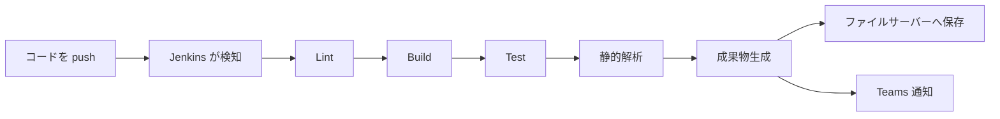

# このリポジトリの CI について（開発者向けガイド）

> 対象読者: この CI 環境を**利用する側**の開発者（CISetup ツールの開発者ではありません）。

## TL;DR（超短縮版）

このリポジトリには **Jenkins の自動 CI** が入っています。**push するとビルド→テスト→静的解析→成果物生成が自動で走り、結果が Teams に通知**され（失敗時はログリンク付き）、**成果物・テスト結果は共有ファイルサーバーに保存**されます。やることは「push して、落ちたら Teams のリンクから原因を見て直す」だけ。CI 設定は `cisetup/` 配下にあり、基本さわらなくて OK です。

---

## これは何？

あなたのリポジトリに **Jenkins による自動 CI** が導入されています。コードを push すると、自動でビルド・テスト・静的解析が走り、**結果が Teams に通知**され、**成果物・テスト結果が共有ファイルサーバーに保存**されます。設定一式はリポジトリ内の `cisetup/` フォルダに入っています（基本さわる必要はありません）。

## push するとどうなる？



| ステージ | 内容 |
|----------|------|
| Lint | コード整形チェック（既定では警告扱いで停止しない） |
| Build | リリース構成でビルド |
| Test | 単体テスト実行（結果は TRX で保存） |
| 静的解析 | アナライザでの解析レポート生成 |
| 成果物生成 | リリース zip を作成 |
| 保存 / 通知 | ファイルサーバーへ配置し、Teams に結果通知 |

## 結果はどこで見る？

- **Teams 通知**: ビルドの成否が届きます。**失敗時はテスト失敗ログへのリンク付き**なので、そこから原因を確認できます。
- **共有ファイルサーバー**: 成果物・テスト結果・解析レポートがビルドごとに保存されます（上書きされず履歴として蓄積）。
- **Jenkins の画面**: 各ステージの詳細ログが見られます。

## 開発者が気をつけること

- **認証情報や個人フォルダのパスをコミットしない**: CI 設定側で分離・除外する仕組みになっていますが、自分のコードにトークン等を埋め込まないでください。
- **テストが落ちると CI も失敗扱い**になります（Teams のログリンクから確認 → 修正 → 再 push）。
- **整形（whitespace）の警告**は通常ビルドを止めませんが、気になる場合はローカルで `dotnet format` を実行してください。
- CI の定義（`cisetup/` 配下の Jenkinsfile やスクリプト）を勝手に編集すると挙動が変わります。変更が必要なときは CI 管理者に相談してください。

## ローカルで事前確認したいとき

push 前に手元で同じビルド/テストを回せます（git 操作なし）:

```powershell
powershell -ExecutionPolicy Bypass -File .\cisetup\scripts\ci-build.ps1 -Configuration Release
powershell -ExecutionPolicy Bypass -File .\cisetup\scripts\ci-test.ps1  -Configuration Release
```
