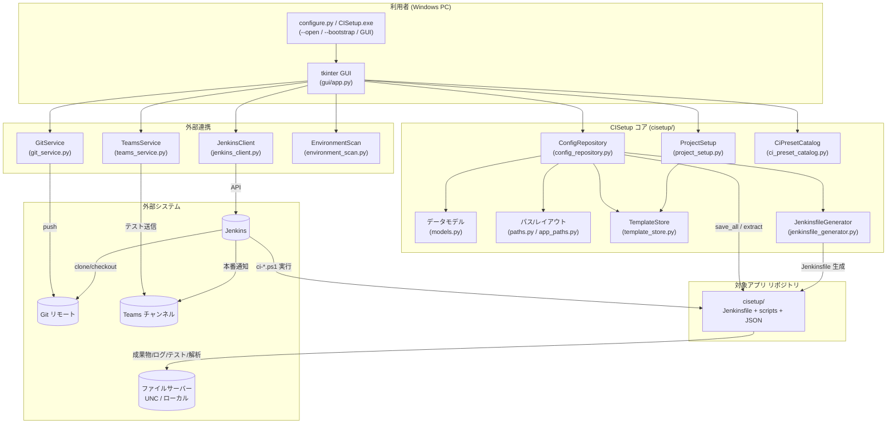
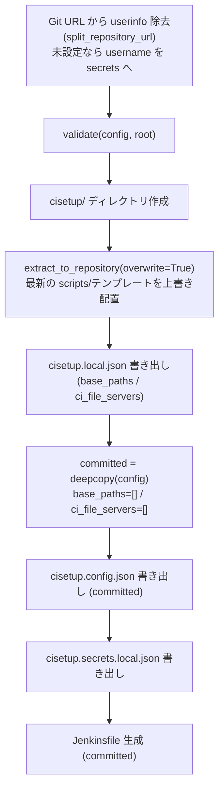
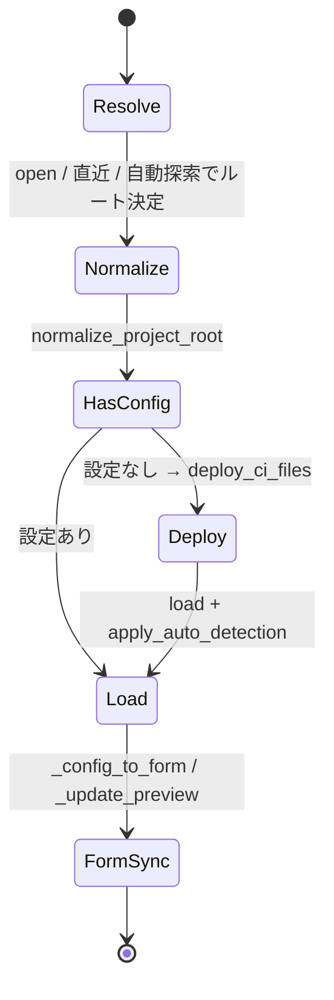
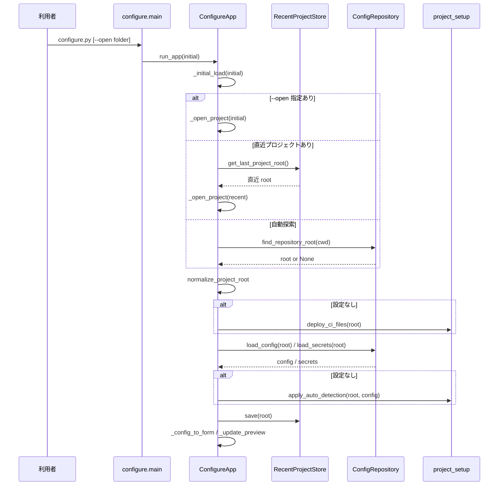
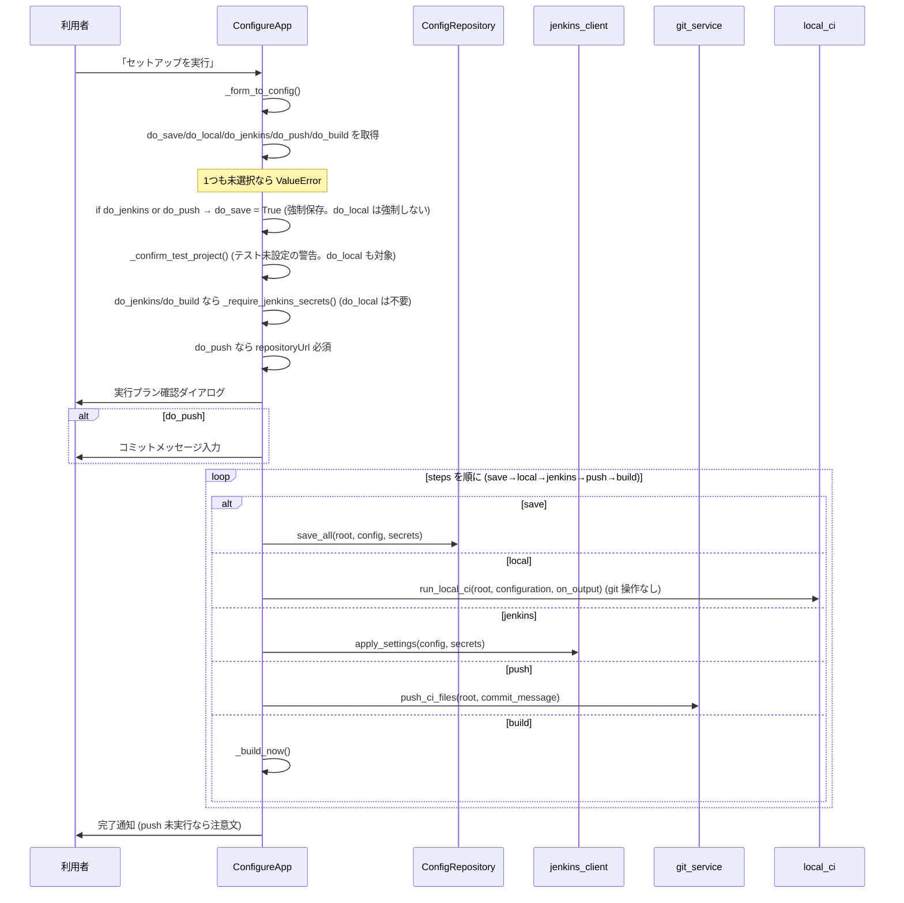
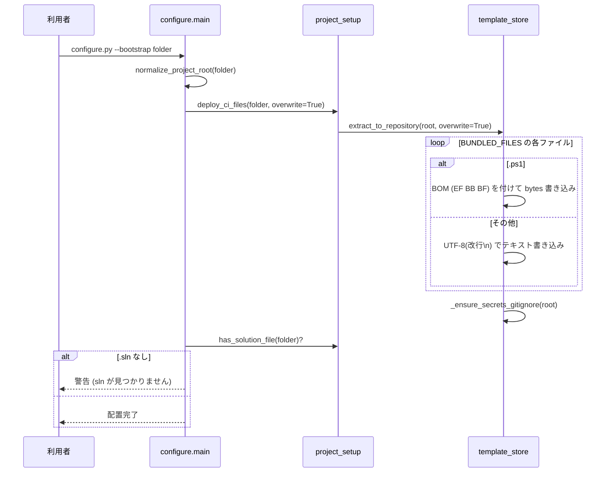
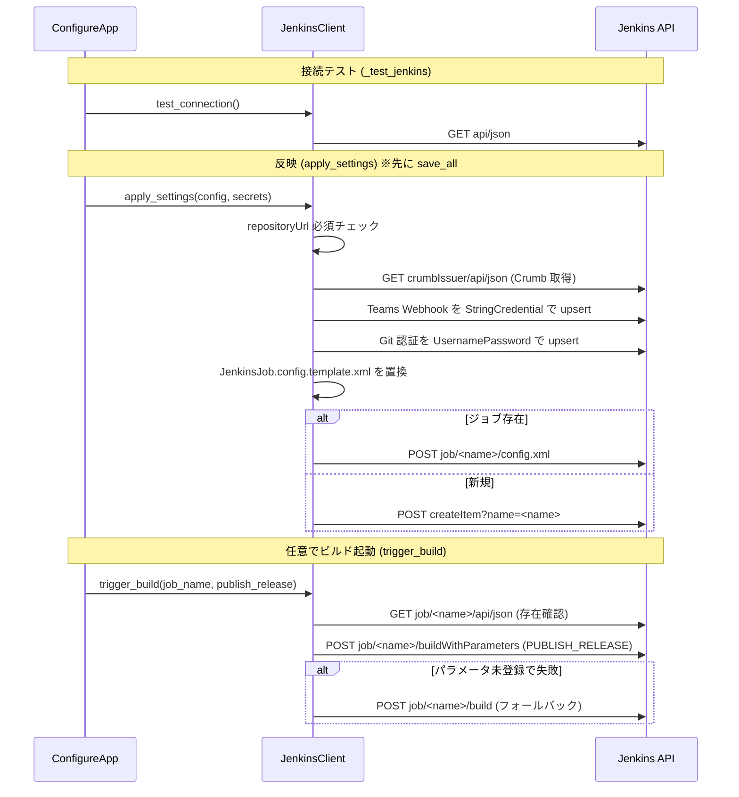
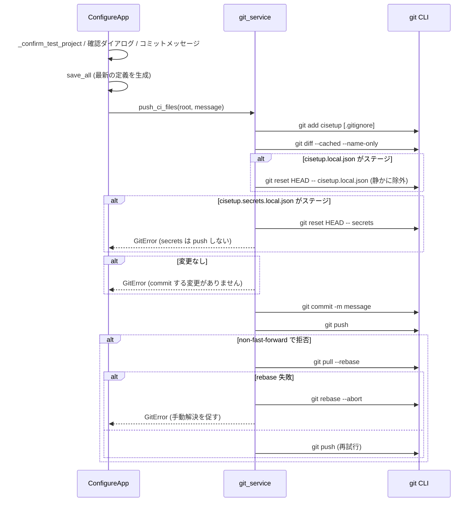
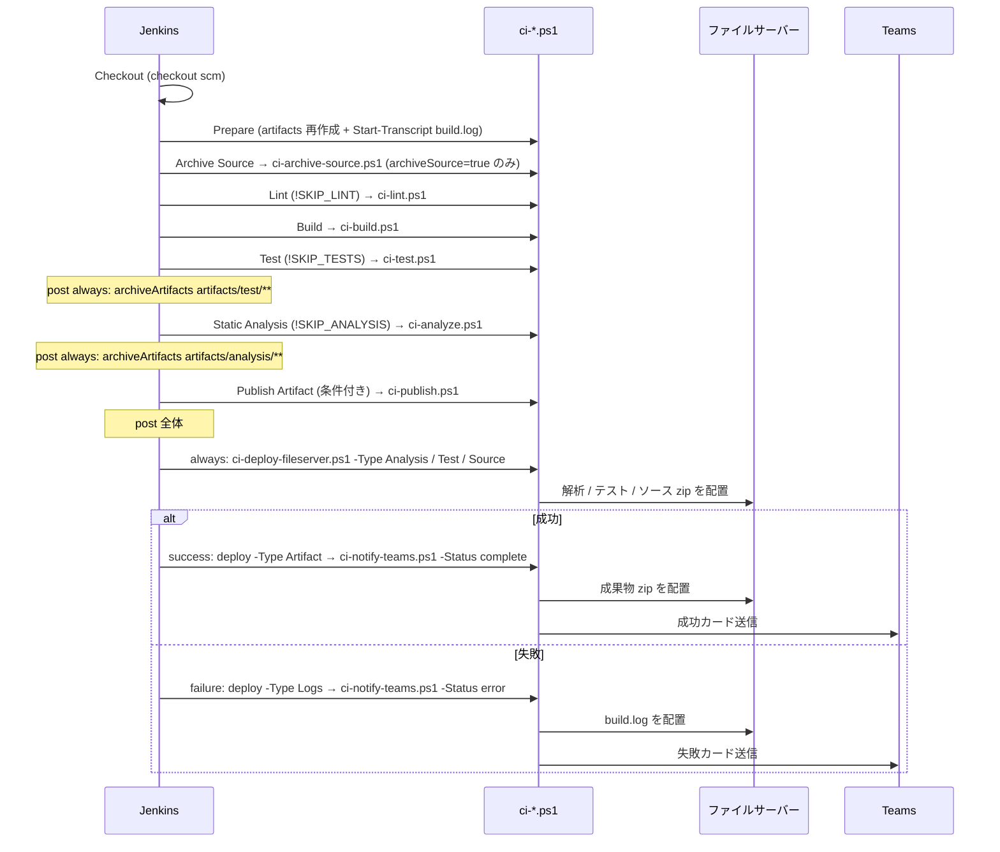
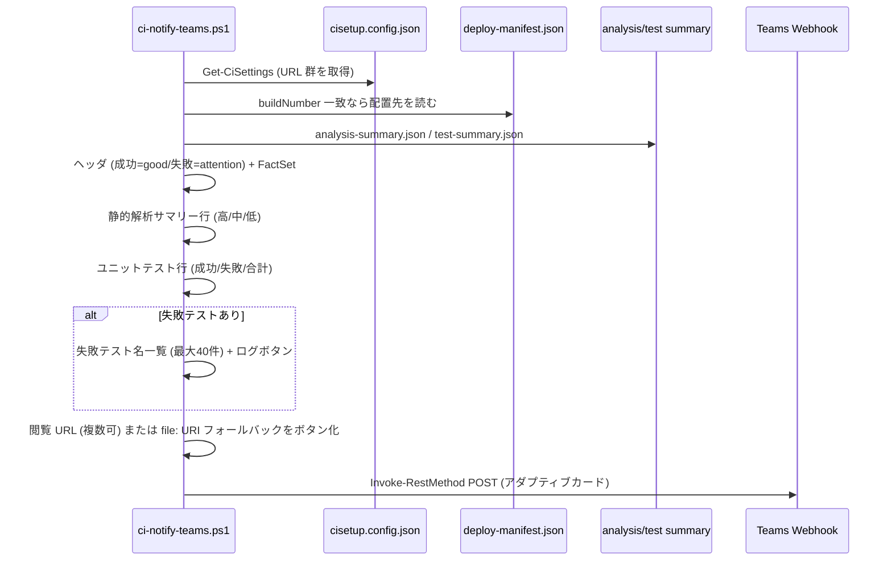

# CISetup 設計仕様書（DESIGN）

本書は CISetup アプリケーションの設計仕様書である。第三者のエンジニアが本書だけを読んで
同等のアプリケーションをゼロから再実装できることを目標に、実装（`cisetup/` 配下のソース）に
基づいて、構成・データモデル・各処理フロー・CI パイプライン挙動・ビルド/配布までを記述する。

- 対象バージョンの正本: `cisetup/cisetup/`（Python パッケージ）と `cisetup/bundled_templates/`（CI テンプレート）。
- 既存ドキュメント（`README.md` / `docs/CI-GUIDE.md` / `docs/GUI.md` / `docs/README-dist.md` /
  `bundled_templates/scripts/TEAMS-WORKFLOW.md`）と内容が重複する箇所は、本書では設計観点に絞り、
  詳細手順はそれらを参照する。

> 表記について: クラス名・関数名・JSON キー・既定値は実装どおりに記載している。
> パス区切りは Windows を基本とし、リポジトリ相対パスは `cisetup\...` のように表記する。

---

## 目次

1. [概要・目的・スコープ](#1-概要目的スコープ)
2. [用語集](#2-用語集)
3. [システム全体像](#3-システム全体像)
4. [技術スタック・前提](#4-技術スタック前提)
5. [ディレクトリ構成と各モジュールの責務](#5-ディレクトリ構成と各モジュールの責務)
6. [データモデル仕様](#6-データモデル仕様)
7. [設定の永続化](#7-設定の永続化)
8. [GUI 仕様](#8-gui-仕様)
9. [主要ユースケースのシーケンス](#9-主要ユースケースのシーケンス)
10. [CI パイプライン詳細](#10-ci-パイプライン詳細)
11. [ビルド・配布](#11-ビルド配布)
12. [エンコーディング・互換性方針](#12-エンコーディング互換性方針)
13. [テスト戦略](#13-テスト戦略)
14. [既知の制約 / 今後の拡張余地](#14-既知の制約--今後の拡張余地)
15. [付録](#15-付録)

---

## 1. 概要・目的・スコープ

### 1.1 CISetup とは

CISetup は、社内の CI 環境（**Jenkins** + **Git** + **Teams 通知** + **共有ファイルサーバー**）の
セットアップを、GUI から数項目入力するだけで完了させる Windows 向けデスクトップツールである。
Python（標準ライブラリの tkinter）製で、配布形態は **単一 exe**（PyInstaller・利用者は Python 不要）。

CISetup が行うことは大きく次の 3 つに分けられる。

1. **CI 定義ファイルの生成・配置** — 対象アプリのリポジトリへ `cisetup\` フォルダを作り、
   `Jenkinsfile`・各ステージの PowerShell スクリプト（`ci-*.ps1`）・設定 JSON を配置する。
2. **Jenkins への反映** — Jenkins API を叩いて、資格情報（Git / Teams Webhook）の登録、
   Pipeline ジョブの作成/更新、（任意で）ビルド起動、サーバー初回設定（プラグイン/エージェント登録）を行う。
3. **Git push** — 生成した CI 定義ファイルだけを commit / push する（機微情報は除外）。

配置された CI 定義は Jenkins 上で動作し、ビルド・テスト・静的解析・成果物生成を行い、
結果をファイルサーバーへ配置し、Teams へ通知する。

### 1.2 解決したい課題

- Jenkinsfile・ジョブ XML・PowerShell スクリプトを手書きする手間と属人化をなくす。
- 個人 ID を含むパス（OneDrive 同期フォルダ等）や認証情報を、誤って Git に push しないようにする。
- .NET だけでなく FPGA（Vivado/Quartus）・C/C++（CMake）・Python など、任意のビルドにも対応する。
- PowerShell 5.1 / 高 DPI / 日本語環境など、社内 Windows の現実的な制約に確実に対応する。

### 1.3 対象ユーザー

- CI を構築する担当者（Jenkins の管理者権限を持つ人）。
- 配布された `CISetup.exe` を使う一般開発者（Python 環境は不要）。

### 1.4 スコープ外（非対象）

- Jenkins / Git サーバー / ファイルサーバー / Teams（Power Automate）そのものの構築・運用。
  CISetup は既存サーバーへ「設定を反映する」立場であり、Jenkins 本体や OS のインストールは行わない
  （Jenkins サーバーの**初回設定**＝必須プラグイン導入とエージェント登録のみ補助する）。
- OneDrive / SharePoint への直接アップロード（共有 URL への書き込みは未対応。後述）。
- 本ツールがビルドする対象アプリ（例: 同一リポジトリ内の C# プロジェクト）のコード自体。

---

## 2. 用語集

| 用語 | 意味 |
|------|------|
| Jenkins | CI サーバー。CISetup が API 経由でジョブ・資格情報・エージェントを登録する対象。 |
| Pipeline ジョブ | Jenkinsfile（Declarative Pipeline）で定義されるジョブ。`JenkinsJob.config.template.xml` から生成。 |
| エージェント (Agent / Node) | 実際にビルドを実行する Jenkins ノード（Windows PC）。JNLP で Jenkins に接続する。 |
| エージェントラベル (agent_label) | ビルドを割り当てるノードを絞り込むラベル。空なら `agent any`。 |
| Teams Webhook | Teams チャンネルの Power Automate（ワークフロー）が払い出す受信 URL。通知カードの送信先。 |
| ファイルサーバー / 共有フォルダ | 成果物 zip・ログ・テスト結果・解析レポートを置く UNC / ローカルパス。 |
| `base_path`（書き込み先ベース） | プロジェクト名を**付けずにそのまま**使う書き込み先（`storage.basePaths`）。 |
| CI_FILE_SERVER（④の書き込み先） | プロジェクト名を**付与**して使う書き込み先（`jenkins.ciFileServers`）。 |
| 実効ルート (resolved / target root) | 各書き込み先に整形規則を適用した結果の基点。CI_FILE_SERVER 系は `<base>\<project>`、base_path 系は `<base>`。 |
| 後勝ち | 同じ実効値を複数箇所に保持する設定で、最後に決まった 1 つだけが効くこと。実効値は常に 1 つ（[7 章](#7-設定の永続化)）。 |
| 機微情報 (secrets) | 認証情報・Webhook 等。`cisetup.secrets.local.json` に保存し Git に push しない。 |
| 個人 ID を含む値 | OneDrive パスや Git ユーザー名など、人名を含みうる値。`cisetup.local.json` / secrets に分離する。 |
| `_MEIPASS` | PyInstaller の onefile exe 実行時に同梱データが展開される一時ディレクトリ。 |
| プロファイル (profile) | ビルド種別。`dotnet`（.NET 自動）か `custom`（任意コマンド）。 |
| プリセット (preset) | プロファイル＋各コマンドのひな型（.NET / FPGA / CMake / Python など）。 |

---

## 3. システム全体像

### 3.1 コンポーネント図



### 3.2 役割分担の要点

- **GUI（`gui/app.py`）** が唯一のオーケストレータ。フォーム値 ↔ データモデルの変換を行い、
  保存・反映・push・ビルド・環境スキャン等の各アクションを呼び出す。
- **`ConfigRepository`** が「ディスクへの読み書き」と「整形・検証・機微情報の分離」を担う。
- **`TemplateStore`** が同梱テンプレート（`bundled_templates/`）をリポジトリの `cisetup\` 配下へ展開する。
  ソース実行時はパッケージ同梱フォルダ、exe 実行時は `_MEIPASS` から読む。
- **`JenkinsClient` / `GitService` / `TeamsService`** が外部システムとの通信を担う。
- 配置後の**ランタイム挙動は Jenkins 上の `ci-*.ps1`** が担い、CISetup アプリは関与しない。

---

## 4. 技術スタック・前提

| 項目 | 内容 |
|------|------|
| 言語 / ランタイム | Python 3.10 以上（`from __future__ import annotations` 前提の型注釈を使用） |
| GUI | 標準ライブラリ `tkinter` / `tkinter.ttk`（追加 GUI 依存なし） |
| 実行時依存 | 標準ライブラリ中心（`requirements.txt` は最小限）。HTTP は `urllib` を使用 |
| 開発時依存 | `pytest>=8` / `coverage>=7` / `pyinstaller>=6` / `pyflakes>=3`（`requirements-dev.txt`） |
| 配布 | PyInstaller 単一 exe（`cisetup.spec`、`console=False` の windowed exe） |
| CI 実行側 | Jenkins エージェント（Windows）+ **Windows PowerShell 5.1 互換**の `ci-*.ps1` |
| .NET ビルド | エージェントに .NET SDK 8 が必要（`dotnet build/test/format/publish`） |
| 文字コード | `.ps1` は **UTF-8 BOM 付き**、その他テキストは UTF-8（改行 `\n`）。詳細は [12 章](#12-エンコーディング互換性方針) |
| OS | Windows（高 DPI 対応・`CREATE_NO_WINDOW` での子プロセス起動など Windows 固有処理あり） |
| Jenkins 認証 | ユーザー名 + API Token（Basic 認証）+ CSRF Crumb |

前提となる外部要素: 起動済みの Jenkins、アクセス可能な Git リモート、書き込み可能な共有フォルダ、
Teams の受信 Webhook。これらの構築自体は [docs/CI-GUIDE.md](CI-GUIDE.md) を参照。

---

## 5. ディレクトリ構成と各モジュールの責務

リポジトリ全体構成は [README.md](../README.md) の「2. ディレクトリ構成」を参照。本章は
アプリ本体パッケージ `cisetup\cisetup\*.py` の責務と主要関数を表にまとめる。

### 5.1 アプリ本体（`cisetup\cisetup\`）

| モジュール | 役割 | 主要なクラス / 関数 |
|------------|------|----------------------|
| `models.py` | 設定/機微情報のデータモデルと JSON（camelCase）相互変換、Git URL 分解、後方互換読み込み | `CISetupConfig` / `ProjectConfig` / `StorageConfig` / `JenkinsConfig` / `GitConfig` / `BuildConfig` / `CISetupSecrets` / `CISetupLocal`、`config_from_dict` / `config_to_dict` / `secrets_*` / `local_*`、`split_repository_url`、`migrate_from_legacy`、`default_config` |
| `config_repository.py` | 設定の読込・保存（`save_all`）、URL サニタイズ、検証、書き込み先の実効ルート計算、プレビュー生成、機微情報の分離 | `ConfigRepository.load_config` / `load_local` / `load_secrets` / `save_all` / `validate` / `effective_write_targets` / `build_target_roots` / `build_preview_paths` / `build_source_preview` |
| `paths.py` | ファイル名定数、リポジトリルート探索/正規化、レイアウト判定、URL 判定、パス連結 | `CI_FOLDER` / `CONFIG_FILE` / `SECRETS_FILE` / `LOCAL_FILE` / `JENKINSFILE`、`is_url` / `join_location` / `config_path` / `secrets_path` / `local_path` / `jenkinsfile_path` / `normalize_project_root` / `resolve_repository_root` / `find_repository_root` / `has_saved_config` |
| `app_paths.py` | パッケージルートの解決（ソース実行と `_MEIPASS` の差を吸収） | `get_package_root` |
| `recent_project.py` | 直近に開いたプロジェクトを `%AppData%\CISetup\recent-project.txt` に記憶 | `RecentProjectStore.get_last_project_root` / `save` |
| `template_store.py` | 同梱テンプレート一覧の正本、`cisetup\` への展開（`.ps1` は BOM 付与）、`.gitignore` への secrets 追記 | `BUNDLED_FILES`、`read_template`、`extract_to_repository`、`bundled_template_dir` |
| `project_setup.py` | `.sln` 解析・プロジェクト自動検出・CI ファイル配置 | `deploy_ci_files`、`has_solution_file`、`parse_solution_projects`、`apply_auto_detection`、`find_test_project`、`count_projects` |
| `ci_preset_catalog.py` | ビルドプリセット定義と検索 | `CiPreset`、`PRESETS`、`find_preset` |
| `jenkinsfile_generator.py` | テンプレートのプレースホルダ置換で `Jenkinsfile` を生成 | `generate_jenkinsfile`、`build_agent_declaration` |
| `jenkins_client.py` | Jenkins API（接続・Crumb・資格情報 upsert・ジョブ upsert・ビルド起動・サーバー初回設定）、ファイルサーバー書き込みテスト | `JenkinsClient`、`apply_settings`、`test_file_server_write`、`extract_agent_secret`、`format_jenkins_error` |
| `teams_service.py` | Teams アダプティブカード（テスト送信）の生成と送信、URL 検証 | `send_test`、`build_test_card_payload`、`validate_url`、`normalize_url` |
| `git_service.py` | CI ファイルのみの add/commit/push、auto-sync（pull --rebase）、secrets/local のステージ検出 | `push_ci_files`、`contains_staged_secrets`、`contains_staged_local`、`DEFAULT_COMMIT_MESSAGE` |
| `local_ci.py` | 配置済み `ci-build.ps1` → `ci-test.ps1` をローカルで実行（git 操作なし）。最初の失敗で停止、出力を 1 行ずつコールバック | `run_local_ci`、`LocalCIError` |
| `environment_scan.py` | Git / .NET SDK 8 / Java / Jenkins サービスの有無チェック | `scan`、`EnvironmentCheckResult` |
| `process_util.py` | 子プロセス起動時にコンソール窓を出さない引数を返す | `no_window_kwargs` |
| `help_texts.py` | 各設定項目の GUI ツールチップ文言（保存先 JSON キーまで明記） | 文字列定数群 |

### 5.2 GUI サブパッケージ（`cisetup\cisetup\gui\`）

| モジュール | 役割 | 主要なクラス / 関数 |
|------------|------|----------------------|
| `app.py` | メインウィンドウと全アクション。フォーム ↔ モデル変換、各処理の起動、複数値入力欄 | `ConfigureApp`、`MultiValueField`、`run_app`、`_run_setup` / `_save_only` / `_apply_jenkins` / `_git_push` / `_run_local_build_test` / `_build_now` / `_setup_server` ほか |
| `layout.py` | 配色定数・共通ウィジェット（カード/ボタン/スクロール/Expander）・DPI 倍率フォント | `card`、`button`、`primary_button`、`ScrollableFrame`、`Expander`、`font`、`set_scale` |
| `commit_dialog.py` | コミットメッセージ入力ダイアログ | `prompt_commit_message`、`CommitMessageDialog` |
| `tooltip.py` | ホバー時のヘルプ吹き出し | `attach_tooltip`、`ToolTip` |
| `__init__.py` | `run_app` / `ConfigureApp` の再公開 | — |

### 5.3 エントリポイント（`cisetup\configure.py`）

`main(argv)` が引数を解析し、3 つの動作に分岐する。

- 引数なし / `--open <folder>`: GUI を起動（`--open` は初期表示フォルダを指定）。
- `--bootstrap <folder>`: GUI なしで CI ファイルのみ配置（`deploy_ci_files(folder, overwrite=True)`）。
- `--help` / `-h`: ヘルプ表示。

windowed exe（`console=False`）でも `--bootstrap` / `--help` をコンソールで動かせるよう、
frozen かつ該当引数があるときだけ `_attach_console_for_cli` が `AllocConsole` でコンソールを確保する。

---

## 6. データモデル仕様

`models.py` の dataclass 群が設定の正本。JSON へは **camelCase**（`_snake_to_camel`）で直列化し、
読み込み時に `_camel_to_snake` で復元する（C# 版 JSON との相互運用のため）。

保存先の凡例: **config** = `cisetup\cisetup.config.json`（コミット対象） /
**local** = `cisetup\cisetup.local.json`（git 非追跡） / **secrets** = `cisetup\cisetup.secrets.local.json`（git 非追跡）。

### 6.1 `ProjectConfig`（JSON: `project`）

| Python 属性 | JSON キー | 型 | 既定値 | 説明 | 保存先 |
|-------------|-----------|----|--------|------|--------|
| `name` | `name` | str | `""`（`default_config` では `"YourProject"`） | プロジェクト名。Teams 表示名・ファイルサーバーのサブフォルダ名に使用 | config |
| `solution_file` | `solutionFile` | str | `""` | ビルド対象 `.sln`（リポジトリルート相対） | config |
| `publish_project` | `publishProject` | str | `""` | `dotnet publish` 対象 `.csproj`（相対） | config |
| `test_project` | `testProject` | str | `""` | テスト `.csproj`。空なら Test ステージをスキップ | config |
| `artifact_prefix` | `artifactPrefix` | str | `""` | 成果物 zip のファイル名先頭 | config |

### 6.2 `StorageConfig`（JSON: `storage`）

| Python 属性 | JSON キー | 型 | 既定値 | 説明 | 保存先 |
|-------------|-----------|----|--------|------|--------|
| `base_paths` | `basePaths` | list[str] | `[]` | プロジェクト名を付けずに使う書き込み先（複数可） | **local** |
| `logs_dir` | `logsDir` | str | `"logs"` | 失敗時ログのフォルダ名 | config |
| `releases_dir` | `releasesDir` | str | `"releases"` | 成果物 zip のフォルダ名 | config |
| `tests_dir` | `testsDir` | str | `"tests"` | テスト結果の専用トップレベルフォルダ名 | config |
| `source_dir` | `sourceDir` | str | `"source"` | 開発環境一式 zip のフォルダ名 | config |
| `use_date_subfolder` | `useDateSubfolder` | bool | `True` | 各カテゴリ配下に日付フォルダ `YYYYMMDD` を作るか | config |
| `archive_source` | `archiveSource` | bool | `False` | pull 済みソースツリーを zip 化して保存するか | config |
| `release_urls` | `releaseUrls` | list[str] | `[]` | 成果物フォルダの閲覧 URL（Teams ボタン用・複数可） | config |
| `analysis_urls` | `analysisUrls` | list[str] | `[]` | 解析レポートの閲覧 URL（複数可） | config |
| `logs_urls` | `logsUrls` | list[str] | `[]` | ログフォルダの閲覧 URL（複数可） | config |
| `tests_urls` | `testsUrls` | list[str] | `[]` | ユニットテストログの閲覧 URL（複数可） | config |

`base_path` / `release_url` / `analysis_url` / `logs_url` / `tests_url` は後方互換アクセサ
（プロパティ）で、対応するリストの先頭要素を読み書きする。`base_paths` は機微（個人 ID を含みうる）
扱いで **local** に保存される（[7 章](#7-設定の永続化)）。

### 6.3 `JenkinsConfig`（JSON: `jenkins`）

| Python 属性 | JSON キー | 型 | 既定値 | 説明 | 保存先 |
|-------------|-----------|----|--------|------|--------|
| `job_name` | `jobName` | str | `"CISetup-CI"` | Pipeline ジョブ名 | config |
| `agent_label` | `agentLabel` | str | `""` | エージェントラベル。空なら `agent any` | config（+ Jenkinsfile 生成） |
| `cron_schedule` | `cronSchedule` | str | `"0 0 * * *"` | 定期ビルドの cron | config（+ Jenkinsfile） |
| `poll_schedule` | `pollSchedule` | str | `"H/5 * * * *"` | `pollSCM`（マージ検知）の間隔。空なら無効 | config（+ Jenkinsfile） |
| `ci_file_servers` | `ciFileServers` | list[str] | `["\\\\fileserver\\ci"]` | プロジェクト名を付与する書き込み先（複数可） | **local** |
| `teams_credential_id` | `teamsCredentialId` | str | `"teams-webhook-url"` | Teams Webhook の Jenkins Credential ID | config |
| `default_configuration` | `defaultConfiguration` | str | `"Release"` | 既定の Build Configuration | config |
| `build_timeout_minutes` | `buildTimeoutMinutes` | int | `30` | 1 ビルドのタイムアウト（分） | config（+ Jenkinsfile） |
| `log_retention_count` | `logRetentionCount` | int | `30` | ビルド履歴保持数 | config（+ Jenkinsfile） |
| `timezone` | `timezone` | str | `"Asia/Tokyo"` | cron の基準 TZ | config |
| `checkout_retry_count` | `checkoutRetryCount` | int | `3` | Checkout ステージの git 取得失敗リトライ回数 | config（+ Jenkinsfile） |
| `retry_wrapper_enabled` | `retryWrapperEnabled` | bool | `false` | true なら cron を別建てジョブ（`<job_name>-trigger`）に移し、Naginator で失敗時リトライ | config（+ Jenkinsfile / Jenkins ジョブ） |
| `retry_max_count` | `retryMaxCount` | int | `3` | `retry_wrapper_enabled` 時の Naginator 最大リトライ回数 | config（+ Jenkins ジョブ） |
| `retry_delay_seconds` | `retryDelaySeconds` | int | `300` | `retry_wrapper_enabled` 時の Naginator リトライ間隔（秒） | config（+ Jenkins ジョブ） |

`retry_wrapper_enabled` が `true` の場合、Jenkinsfile 自身の cron トリガーは空になり
（`jenkinsfile_generator.generate_jenkinsfile` が `{{CRON_TRIGGER_LINE}}` を空文字に置換）、
代わりに `jenkins_client.upsert_trigger_job` が `JenkinsTriggerJob.config.template.xml` から
Freestyle のラッパージョブ（`<job_name>-trigger`）を作成する。このジョブは cron で起動され、
Parameterized Trigger プラグインで本体 Pipeline ジョブを起動・待機し、失敗を伝播する。
本体が失敗すればラッパージョブも失敗となり、Naginator が `retry_max_count` / `retry_delay_seconds`
に従ってラッパージョブごと再試行する。Pipeline ジョブは Naginator 非対応、かつ Jenkinsfile 取得
自体の失敗は Pipeline 開始前に起きる（Jenkinsfile 内の `retry()` でも救えない）ため、この構成にしている。

`ci_file_server`（単数）は後方互換アクセサで `ci_file_servers[0]` を読み書きする。
`ci_file_servers` は機微扱いで **local** に保存される。

### 6.4 `GitConfig`（JSON: `git`）

| Python 属性 | JSON キー | 型 | 既定値 | 説明 | 保存先 |
|-------------|-----------|----|--------|------|--------|
| `repository_url` | `repositoryUrl` | str | `""` | clone 用 URL。保存時に埋め込みユーザー情報を除去 | config |
| `branch` | `branch` | str | `"main"` | CI 対象ブランチ | config |
| `credential_id` | `credentialId` | str | `"internal-git"` | Git 認証の Jenkins Credential ID | config |

### 6.5 `BuildConfig`（JSON: `build`）

| Python 属性 | JSON キー | 型 | 既定値 | 説明 | 保存先 |
|-------------|-----------|----|--------|------|--------|
| `preset` | `preset` | str | `"dotnet"` | 選択中プリセット ID | config |
| `profile` | `profile` | str | `"dotnet"` | ビルドプロファイル（`dotnet` / `custom`） | config |
| `build_command` | `buildCommand` | str | `""` | custom 時のビルドコマンド（必須） | config |
| `lint_command` | `lintCommand` | str | `""` | custom 時の Lint コマンド（任意） | config |
| `analyze_command` | `analyzeCommand` | str | `""` | custom 時の解析コマンド（任意） | config |
| `publish_command` | `publishCommand` | str | `""` | custom 時の成果物生成コマンド（任意） | config |
| `test_command` | `testCommand` | str | `""` | custom 時のテストコマンド（任意） | config |
| `artifact_glob` | `artifactGlob` | str | `""` | custom 時の成果物 glob（`;` / `,` 区切り） | config |

### 6.6 `CISetupConfig`（ルート）

`project` / `storage` / `jenkins` / `git` / `build` を保持する集約。`config_to_dict` / `config_from_dict`
で JSON と相互変換する。

### 6.7 `CISetupSecrets`（JSON: `cisetup.secrets.local.json`）

| Python 属性 | JSON キー | 型 | 既定値 | 説明 |
|-------------|-----------|----|--------|------|
| `jenkins_url` | `jenkinsUrl` | str | `""` | Jenkins のトップ URL |
| `jenkins_user` | `jenkinsUser` | str | `""` | Jenkins ログインユーザー |
| `jenkins_api_token` | `jenkinsApiToken` | str | `""` | API Token |
| `git_username` | `gitUsername` | str | `""` | Git ユーザー名 |
| `git_password` | `gitPassword` | str | `""` | Git パスワード / PAT |
| `teams_webhook_url` | `teamsWebhookUrl` | str | `""` | Teams Webhook URL |

すべて **secrets** に保存（git 非追跡）。

### 6.8 `CISetupLocal`（JSON: `cisetup.local.json`）

| Python 属性 | JSON キー | 型 | 既定値 | 説明 |
|-------------|-----------|----|--------|------|
| `base_paths` | `basePaths` | list[str] | `[]` | 書き込み先ベース（個人 ID を含みうる） |
| `ci_file_servers` | `ciFileServers` | list[str] | `[]` | CI_FILE_SERVER 群（個人 ID を含みうる） |

`base_path` / `ci_file_server`（単数）は後方互換アクセサ。**local** に保存（git 非追跡）。

### 6.9 機微情報・個人 ID の分離方針

3 段階に分離する。

1. **secrets**（`cisetup.secrets.local.json`）: 認証情報・Webhook。
2. **local**（`cisetup.local.json`）: 個人 ID を含みうる書き込み先（`base_paths` / `ci_file_servers`）。
3. **config**（`cisetup.config.json`、コミット対象）: 上記以外。コミット時は `base_paths` と
   `ci_file_servers` を**空にして**書き出す（`save_all` 内で `committed` のクローンを作り、両者を `[]` にする）。

加えて Git URL に `user@` が埋め込まれていれば `split_repository_url` で除去し、ユーザー名は
secrets（`git_username`、未設定時のみ）へ退避する。

> 補足: `.gitignore` には `cisetup/cisetup.secrets.local.json`（と旧名）が自動追記される
> （`template_store._ensure_secrets_gitignore`）。`cisetup.local.json` は `.gitignore` には
> 追記されないが、`git_service.push_ci_files` がステージから自動的に外すため push されない（[9.5](#95-git-push)）。

---

## 7. 設定の永続化

### 7.1 保存先パスとレイアウト

`paths.py` の定数: `CI_FOLDER="cisetup"` / `CONFIG_FILE="cisetup.config.json"` /
`SECRETS_FILE="cisetup.secrets.local.json"` / `LOCAL_FILE="cisetup.local.json"` / `JENKINSFILE="Jenkinsfile"`。

- **標準レイアウト**: `<repo>\cisetup\cisetup.config.json` ほか（`config_path` / `secrets_path` /
  `local_path` / `jenkinsfile_path` / `scripts_dir` がいずれも `<repo>\cisetup\` 配下を返す）。
- **旧レイアウト（後方互換・読込のみ）**: `<repo>\cisetup.config.json`（ルート直下）、
  さらに古いフラット形式 `<repo>\ci.settings.json`。保存は常に標準レイアウトで行う。

`load_config` の探索順は「標準 config → 旧 config（ルート直下）→ 旧フラット（`migrate_from_legacy`）→
無ければ `default_config()`」。読み込みは BOM 許容（`utf-8-sig`）。読込後、`load_local` の値があれば
`base_paths` / `ci_file_servers` をローカル値で上書きする。

### 7.2 リポジトリルートの決定

| 関数 | 役割 |
|------|------|
| `normalize_project_root` | 選択パスが `cisetup\`（設定入り）なら親へ繰り上げ。それ以外はそのまま（入れ子 `cisetup\cisetup\` の生成防止） |
| `resolve_repository_root` | 「保存した設定を開く」用。`cisetup\` を選んだら親、設定があるフォルダならそれ、無ければ親方向へ探索 |
| `find_repository_root` | 起動時の自動探索。`cisetup` レイアウト / 旧レイアウト / `ci.settings.json` / `*.sln` のいずれかを持つ祖先を返す |
| `has_saved_config` | 標準 + 旧レイアウトの設定ファイル有無 |

### 7.3 URL サニタイズと検証（`validate`）

`save_all` は `validate` を先に呼ぶ。`validate` の主なルール:

- `project.name` 必須。
- プロファイル別: `custom` は `build.build_command` 必須。`dotnet` は `solution_file` /
  `publish_project` / `artifact_prefix` 必須、さらに `.sln` / publish `.csproj` /（指定時）test `.csproj`
  がリポジトリ内に実在すること。
- `cron_schedule` 必須。
- 書き込み先（`ci_file_servers` か `base_paths` のいずれか）が最低 1 つ必要。
- 書き込み先欄に **URL（`http(s)://`）は不可**（`paths.is_url` で判定）。無人 CI から共有 URL へ
  直接書き込めないため、UNC / ローカルパスを指定させる。共有 URL は別の `*_urls` 欄に入れる。

`is_url` は値が `http://` / `https://`（小文字化判定）で始まるかで判定する。

### 7.4 `save_all` の処理順



config / local / secrets の JSON 書き出しはいずれも `indent=2, ensure_ascii=False`、末尾に改行、
`encoding="utf-8"`（BOM なし）、`newline="\n"`。

### 7.5 書き込み先の実効ルートと「後勝ち」

複数の書き込み先を持てる（④ `ci_file_servers` と詳細の `base_paths` は**併用可・相互排他ではない**）。
デプロイ時の実効ルールは `build_target_roots` が表現する。

| 入力 | 実効ルート |
|------|-----------|
| `ci_file_servers` の各値 `<base>` | `<base>\<project>`（プロジェクト名を付与） |
| `base_paths` の各値 `<base>` | `<base>`（そのまま） |

重複は**実効ルート（小文字）で除外**する（`④=<base>\<project>` と `base_path=<base>` が同一ルートに
解決される二重コピーを防ぐ）。`ci-deploy-fileserver.ps1` の `Add-WriteTarget` も同一規則・同一の
重複排除（`$root.ToLowerInvariant()`）で一致させている。

`effective_write_targets` は「全書き込み先（重複除去・整形前の入力文字列）」を返し、
ファイルサーバー書き込みテスト（GUI の各先テスト）に使う。

**「後勝ち（実効値は常に 1 つ）」** の意味: 同一の値が複数の格納先（config / local）に重複して
読み込まれうる場面では、`load_config` がローカル値で config の値を上書きし、
`_coalesce_list` が「複数形キー → 旧単数形キー」の順で**最初に値があるものだけ**を採用する。
すなわち最終的に効く実効値は常に 1 系統に収束する。

### 7.6 プレビュー生成

GUI 表示用に代表（先頭の書き込み先）のレイアウト例を返す。

- `build_preview_paths` → `(logs, releases, tests)`。CI_FILE_SERVER 指定時のテストは
  `<fileServer>\<testsDir>\<project>[\date]`、base_path のみなら `<base>\<testsDir>[\date]`。
- `build_source_preview` → `<root>\<sourceDir>[\date]`（releases / logs と同じ category 構造）。

`join_location` は URL なら `/`、パスなら `\` で連結する（CI 側 `Join-StorageChild` と一致）。

---

## 8. GUI 仕様

### 8.1 画面構成

`ConfigureApp`（`tk.Tk` サブクラス）は縦スクロール（`ScrollableFrame`）の 1 画面に、上から順に
カードを並べる。起動時に高 DPI 対応（`_enable_dpi_awareness`）と表示倍率取得（`set_scale`）を行う。

| 順 | セクション | 主な内容 |
|----|------------|----------|
| — | ヘッダ | タイトル「CISetup」と説明 |
| — | はじめての方へ | 使い方の概要カード |
| — | 環境チェック | 「環境をスキャン」/ 入手先リンク / 自動化できない準備の手順（Expander） |
| — | まずはプリセットを選ぶ | プリセット選択 + 「このプリセットを適用」 |
| ① | アプリのフォルダ | フォルダ選択・読み込み・保存した設定を開く |
| ② | 社内 Git | リポジトリ URL / ブランチ / ユーザー名 / パスワード(PAT) |
| ③ | Teams 通知 | Webhook URL / 閲覧用 URL（解析・成果物・ログ・テスト、各複数可）/ テスト送信 |
| ④ | 成果物・ログの保存先 | CI_FILE_SERVER（複数可）/ 開発環境一式 zip のチェック |
| ⑤ | Jenkins への接続 | Jenkins URL / ユーザー名 / API Token / 接続テスト |
| ⑥ | セットアップを実行 | 5 チェックボックス（保存 / ローカルでビルド＆テスト / Jenkins 反映 / Git push / テストビルド）+ 実行ボタン + 「設定だけ保存」 + publish チェック + ローカル実行ログ欄 |
| — | 詳細設定（Expander） | ビルド種別 / 自動入力項目 / 保存先の詳細 / CI ジョブ / Jenkins サーバー初回設定 / 手動操作 |
| — | ステータスバー | 状態表示 |

### 8.2 入力欄の種類

- **単一値欄**（`_add_field`）: `tk.StringVar` を `self._fields[key]` に登録。`key` は
  `"project.name"` のようなドット区切り。ツールチップ・参照ボタン・実在チェック表示を任意で付加。
- **複数値欄**（`MultiValueField` / `_add_multi_field`）: ＋で行追加、−で行削除（1 行のときは
  クリアのみ）。値取得（`get_values`）時に空行は無視。`self._multi_fields[key]` に登録。
  対象は `jenkins.ci_file_servers` / `storage.base_paths` / `storage.{release,analysis,logs,tests}_urls`。

フォーム ↔ モデルは `_config_to_form` / `_form_to_config` で相互変換。値変更のたびに
`_on_field_changed` → `_update_preview`（保存先プレビューと実在チェックの再計算）が走る。

### 8.3 相互排他・後勝ち・併用の挙動

- ④ CI_FILE_SERVER と詳細の「書き込み先ベース」は**併用可**（両方の全先へコピー）。相互排他ではない。
- プロファイルは `dotnet` / `custom` の二択（コンボ）。`custom` 選択時のみカスタムコマンド欄が表示される。
- プリセット「適用」は、既存のビルドコマンドがあると上書き確認ダイアログを出す。
- 実効値は常に 1 つに収束する（[7.5](#75-書き込み先の実効ルートと後勝ち)）。

### 8.4 プロジェクトを開く際の状態遷移



### 8.5 ヘルプ吹き出し

`help_texts.py` の文言を `attach_tooltip`（`ToolTip`、ホバー 400ms 後に表示）でラベル/入力欄に付ける。
各文言は「【何を】【どこで使う】【例】【保存先】」の体裁で、JSON キーまで明記している。

### 8.6 非同期実行とエラー表示

各アクションは `_run_async` でデーモンスレッド実行し、例外（`ValueError` / `JenkinsError` /
`GitError` / `OSError`）を捕捉して `messagebox.showerror` とステータスへ反映する。メッセージに
「書き込み先ベース」を含む場合は詳細設定 Expander を開いて該当欄へフォーカスする。
確認ダイアログ・コミット入力はメインスレッドへ `after` でマーシャリングし、`threading.Event` で待つ。

---

## 9. 主要ユースケースのシーケンス

### 9.1 アプリ起動 / プロジェクトを開く



### 9.2 「セットアップを実行」フロー（⑥）

チェックボックスの既定は **保存=ON / ローカルでビルド＆テスト=OFF / Jenkins 反映=ON / Git push=OFF / テストビルド=OFF**。
内部の実行順は常に **保存 → ローカル → Jenkins 反映 → Git push → テストビルド**（チェックされたものだけ）。

重要: **Jenkins 反映または Git push が選ばれている場合、保存を強制的に ON にする**
（古い定義のまま push/反映するのを防ぐため）。

**ローカルでビルド＆テスト**（`local` ステップ）は、配置済みの `cisetup\scripts\ci-build.ps1` →
`ci-test.ps1` を `local_ci.run_local_ci` でこの PC でそのまま実行する**純粋なローカル処理**。
**git 操作（fetch / pull / push）は一切なく、Jenkins も使わない**ため、保存の強制も
`_require_jenkins_secrets()` も発生しない。ビルドが失敗したらテストは実行しない（最初の失敗で停止）。
出力はバックグラウンドスレッドから `after` 経由で「ローカル実行ログ」欄へ流し込み、UI を固めない。
配置済みスクリプトを実行する仕様のため、設定変更を反映するには先に「設定を保存」しておく
（保存は強制しない設計）。



`_build_now` は `JenkinsClient.trigger_build(job_name, publish_var)` を呼ぶ。`publish_var` は
「テストビルドで成果物 zip も作成・保存する」チェック（既定 OFF）に対応し、`PUBLISH_RELEASE`
パラメータとして渡る。

### 9.3 CI ファイル配置（`--bootstrap` / `.sln` 自動検出 → テンプレート展開）



GUI で「フォルダを選ぶ」→ 設定が無ければ同様に展開し、`apply_auto_detection` で `.sln` を解析
（`parse_solution_projects` の `Project(...)` 行から `.csproj` を列挙、なければ `rglob`）して
プロジェクト名 / `.sln` / publish 対象 / テスト対象 / 成果物プレフィックス / ジョブ名を自動補完する。
publish 対象は「実行アプリ（OutputType Exe/WinExe）優先 → テスト以外 → 先頭」の順で推定する。

### 9.4 Jenkins ジョブ作成/更新（接続テスト → 資格情報 → ジョブ config → 任意でビルド）



資格情報の upsert は「存在すれば `config.xml`、無ければ `createCredentials`」へ POST する。
空値（Webhook 未設定・Git ユーザー名未設定）はスキップする。HTTP エラーは
`format_jenkins_error` で 401/403 を分かりやすい日本語メッセージに整形する。

### 9.5 Git push



`_run_git` は `GIT_TERMINAL_PROMPT=0` 等で対話を抑止し、ローカル操作 30 秒 / リモート 120 秒で
タイムアウトする。`add` 対象は `cisetup`（と存在すれば `.gitignore`）のみで、リポジトリ全体は触らない。

### 9.6 Jenkins 上の CI パイプライン実行

実際のステージ順（`Jenkinsfile.template`）は次のとおり。**Archive Source は Prepare の直後**に走る点に注意。



`Publish Artifact` ステージの実行条件は `PUBLISH_RELEASE=true` または ブランチ `main`/`master`、
タグ `v\d+.*`、`TimerTrigger`（cron）、`SCMTrigger`（pollSCM）のいずれか。詳細は [10 章](#10-ci-パイプライン詳細)。

### 9.7 Teams 通知



**失敗テストのみ**: 失敗したテストがある場合だけ「失敗したテスト:」見出しと失敗テスト名
（最大 40 件、超過分は「... 他 N 件失敗」）、および「ユニットテストログを開く」ボタンをカードに載せる。
成功のみのときは「すべてのテストが成功しました」を表示し、失敗一覧・ログボタンは出さない。
リンクは `storage.*Urls`（複数可・2 件以上は連番）を優先し、URL が無ければ配置先の `file:` URI を
1 つだけフォールバックボタンにする。GUI からの「テスト送信」（`teams_service.send_test`）は
本番と同じ見た目のサンプルカードを送る（失敗 0 件のサンプル）。

---

## 10. CI パイプライン詳細

### 10.1 共通ローダー `ci-config.ps1`

各ステージ（`ci-build.ps1` 等）から dot-source される。`Get-CiSettings` が
`cisetup\cisetup.config.json`（旧: ルート直下 / `ci.settings.json`）を読み、`cisetup.local.json` が
あれば `basePaths` / `ciFileServers` を上書きして、`PSCustomObject` で設定を返す。レイアウト
（`cisetup` / `legacy`）判定、URL 判定（`Test-StorageUrl`）、配列正規化（`ConvertTo-StringArray` /
`Get-ConfigList`）、パス連結（`Join-StorageChild`）のユーティリティも提供する。

### 10.2 各ステージの入出力

| ステージ | スクリプト | dotnet 動作 | custom 動作 | 主な出力 |
|----------|------------|-------------|-------------|----------|
| Prepare | （Jenkinsfile 内 inline） | `artifacts` 削除→再作成、`Start-Transcript artifacts\logs\build.log` | 同左 | `artifacts\logs\build.log` |
| Archive Source | `ci-archive-source.ps1` | `archiveSource=true` のときソースツリーを zip 化 | 同左 | `artifacts\source\<prefix>-<番号|日時>-src.zip` |
| Lint | `ci-lint.ps1` | `dotnet restore` → `dotnet format --verify-no-changes`（差分は警告のみ）→ アナライザ付きビルド | `lintCommand`（空ならスキップ） | コンソール |
| Build | `ci-build.ps1` | `dotnet restore` → `dotnet build -c <cfg> --no-restore` | `buildCommand`（必須） | ビルド成果 |
| Test | `ci-test.ps1` | `dotnet test`（TRX 出力）→ TRX 解析 | `testCommand`（空ならスキップ） | `artifacts\test\test-results.trx` / `test-summary.json` / `test-failures.log` |
| Static Analysis | `ci-analyze.ps1` | Roslyn 全ルール有効でビルド→指摘を High/Medium/Low に分類 | `analyzeCommand`（空ならスキップ） | `artifacts\analysis\analysis-report.html` / `.md` / `.csv` / `analysis-summary.json` / `analysis-build.log` |
| Publish Artifact | `ci-publish.ps1` | `dotnet publish`（framework-dependent）→ zip | `publishCommand` 実行 → `artifactGlob` で収集 → zip | `artifacts\release\*.zip` |
| Post: deploy | `ci-deploy-fileserver.ps1` | 各カテゴリを全書き込み先へコピー、配置先を `deploy-manifest.json` に記録 | 同左 | ファイルサーバー上の各フォルダ |
| Post: notify | `ci-notify-teams.ps1` | 1 枚のアダプティブカードを送信 | 同左 | Teams 通知 |

補足:
- `ci-test.ps1` は `--no-build` を付けず `dotnet test` 自身に restore/build させる（テストプロジェクトが
  `.sln` に含まれない場合の VSTest エラー回避）。`PowerShell 5.1` 対策で `List[object].ToArray()` を使う。
- `ci-analyze.ps1` の `FailOn`（`None`/`High`/`Medium`）で重大度に応じてステージ失敗にできる。
  セキュリティ系ルール（`CA3xxx`/`CA5xxx`/特定 `CA2xxx`/`SCS*`/`SEC*`）は High 扱い。
- `ci-publish.ps1`（custom）の glob は `Convert-GlobToRegex` で `*`/`?`/`**` を正規表現へ変換して収集する。

### 10.3 `artifacts\` ディレクトリ構造（エージェント上）

```
artifacts\
├── logs\build.log              … Prepare で Transcript 開始
├── source\<prefix>-<n>-src.zip … Archive Source（archiveSource=true 時）
├── test\
│   ├── test-results.trx
│   ├── test-summary.json       … total/passed/failed/skipped/tests[]
│   └── test-failures.log       … 失敗があるときのみ
├── analysis\
│   ├── analysis-report.html / .md / analysis-findings.csv
│   ├── analysis-summary.json   … high/medium/low/total
│   └── analysis-build.log
├── publish\…                   … dotnet publish 出力（中間）
├── release\*.zip               … 成果物 zip
└── deploy-manifest.json        … 各 deploy が配置先を追記（buildNumber で世代管理）
```

### 10.4 ファイルサーバー配置と重複排除

`ci-deploy-fileserver.ps1 -Type <Logs|Artifact|Analysis|Test|Source>` が、`CI_FILE_SERVER`
（Jenkins パラメータ/環境変数）が指定されていればそれを単一の書き込み先として採用し、無ければ
`config`/`cisetup.local.json` の `ciFileServers`（プロジェクト名付与）+ `basePaths`（そのまま）の全先を使う。
重複は**実効ルート（小文字）**で除外する（GUI の `build_target_roots` と一致）。書き込み先が共有 URL
の場合はその先だけスキップ（警告）する。

配置レイアウト（`useDateSubfolder=true` のとき）:

| Type | 配置先 |
|------|--------|
| Logs | `<root>\<logsDir>\<date>\<job>-<番号>-<時刻>.log` |
| Artifact | `<root>\<releasesDir>\<date>\<zip>` |
| Analysis | `<root>\analysis\<date>\<job>-<番号>-<時刻>\<files>` |
| Source | `<root>\<sourceDir>\<date>\<zip>` |
| Test | `<testsRoot>\<date>\<job>-<番号>-<時刻>\<files>`（専用トップレベル） |

ここで `<root>` は CI_FILE_SERVER 系なら `<base>\<project>`、base_path 系なら `<base>`。テストの
`<testsRoot>` は CI_FILE_SERVER 系なら `<base>\<testsDir>\<project>`、base_path 系なら `<base>\<testsDir>`。
テスト結果を releases/logs/analysis と混ざらない独立フォルダに分離するための設計。

### 10.5 ソースアーカイブ（`archive_source`）

`ci-archive-source.ps1` は `storage.archiveSource=true` のときのみ動作（自己ゲート。Jenkinsfile に
`when` 条件は不要）。除外: `.git` / `artifacts` / `bin` / `obj` / `.vs` / `node_modules` / `packages` /
`TestResults`（ディレクトリ）と `*.user`（ファイル）。PowerShell 5.1 互換のため
`System.IO.Compression.ZipFile` を直接使う。再利用ワークスペース対策として出力先の旧 zip を一掃してから作る。

### 10.6 成果物・テスト結果・ログの流れ（まとめ）

- ログ: Prepare で Transcript 開始 → 失敗時に `deploy -Type Logs` でファイルサーバーへ。
- テスト結果: `ci-test.ps1` が `artifacts\test\` に出力 → Jenkins が `archiveArtifacts` で保管 →
  `deploy -Type Test` でファイルサーバーへ → 失敗時は Teams に失敗テスト名とログリンク。
- 解析: `ci-analyze.ps1` が `artifacts\analysis\` に出力 → `deploy -Type Analysis` →
  Teams に件数サマリーと HTML レポートボタン。
- 成果物 zip: `ci-publish.ps1` が `artifacts\release\` に出力 → 成功時 `deploy -Type Artifact` →
  Teams に成果物フォルダボタン。

---

## 11. ビルド・配布

### 11.1 PyInstaller spec（`cisetup.spec`）

- エントリ: `configure.py`。`datas` に `bundled_templates` と `assets` を同梱。`hiddenimports=["tkinter"]`。
- `EXE`: `name="CISetup"`、`console=False`（windowed）、`upx=True`、`icon=assets\icon.ico`。onefile。
- exe 実行時、`app_paths.get_package_root()` は `sys._MEIPASS` を返し、`template_store` はそこから
  `bundled_templates` を読む。

### 11.2 再ビルド（`tools\rebuild_exe.py`）

- `pip install pyinstaller` の後 `python -m PyInstaller cisetup.spec --clean --noconfirm` を実行し、
  `dist\CISetup.exe` を生成する。
- exe 鮮度判定: `EXE_SOURCE_GLOBS = cisetup/**/*.py, configure.py, cisetup.spec, bundled_templates/**/*`
  の最新 mtime より exe が（`margin=1.0` 秒を超えて）古い、または exe が無ければ stale。

### 11.3 配布 zip（`tools\Package-Distribution.ps1`）

`rebuild_exe.py` を呼んでから `dist\CISetup-<Version>\` を作り、次を同梱して `CISetup-<Version>.zip` 化する。

```
CISetup-<Version>/
├── CISetup.exe
├── Setup-Project.bat
├── README.md              … docs/README-dist.md をリネーム同梱
└── docs/                  … CI-GUIDE.md / GUI.md / CISetup-CI-Guide.marp.md
```

`bundled_templates/` は exe に埋め込まれるため zip には個別同梱しない。
`tools\Build-Exe.bat` は `rebuild_exe.py` を呼ぶだけのバッチ。

### 11.4 exe 鮮度チェック（`tests\test_exe_freshness.py`）

`dist\CISetup.exe` が無い、または `exe_is_stale()` が真（ソースより古い）のとき `pytest.fail`。
すなわち `cisetup/` / `configure.py` / `cisetup.spec` / `bundled_templates/` を変更したら exe の
再ビルドが必要。**本書はドキュメントのみの追加であり exe には影響しない**（exe はドキュメントを同梱しない）。

---

## 12. エンコーディング・互換性方針

| 対象 | 方針 | 根拠 |
|------|------|------|
| `.ps1` | **UTF-8 BOM 付き**で配置（先頭に `EF BB BF`） | Windows PowerShell 5.1 は BOM なし UTF-8 を Shift-JIS とみなすため。`template_store.extract_to_repository` が BOM を付与 |
| その他テキスト（JSON / Jenkinsfile） | UTF-8（BOM なし）、改行 `\n` | `save_all` / `generate_jenkinsfile` が `newline="\n"` で書く |
| 読み込み | BOM 許容（`utf-8-sig`） | 既存 BOM 付きファイルも読めるように |
| PowerShell 5.1 の落とし穴 | 関数内で要素追加した `List[object]` を `@(...)` で配列化すると "Argument types do not match" になる → `.ToArray()` を使う | `ci-test.ps1` / `ci-notify-teams.ps1` のコメント |
| 三項演算子不可 | PS 5.1 は `? :` 非対応 → `if/else` で代替 | `ci-archive-source.ps1` |
| 空パラメータ補正 | Jenkins 自動トリガーで `CONFIGURATION` / `ANALYSIS_FAIL_ON` が空文字で渡ることがある → 各 `ci-*.ps1` 冒頭で既定値に補正 | MSB4126 等の回避 |
| 子プロセス | `CREATE_NO_WINDOW` でコンソール窓を抑止 | `process_util.no_window_kwargs`（GUI/exe 用） |
| 高 DPI | `SetProcessDpiAwarenessContext` 等で Per-Monitor v2 を有効化、フォントを倍率追従 | `app.py._enable_dpi_awareness` / `layout.set_scale` |

---

## 13. テスト戦略

| 項目 | 内容 |
|------|------|
| フレームワーク | `pytest`（`tests/` 配下、`conftest.py` で `ROOT` を `sys.path` に追加、`sln_repo` フィクスチャ提供） |
| カバレッジ | `.coveragerc`（`source=cisetup`、`branch=True`、`show_missing`） |
| GUI テスト | `tkinter` を `importorskip`、ディスプレイ不可なら skip。`ConfigureApp` を生成し `withdraw()`、ダイアログ/通知をモンキーパッチで無効化 |
| 外部依存のモック | `JenkinsClient` を `FakeClient` に差し替え、`git_service.push_ci_files` / `teams_service.send_test` / `apply_settings` をモンキーパッチ |
| 主な観点 | ① `save_all` で config.json 生成、② テスト未設定の確認ダイアログ、③ run-setup の順序と強制保存（`test_run_setup_push_forces_save`）、④ 全書き込み先への書き込みテスト、⑤ レイアウト正規化（`cisetup\` 選択→親）、⑥ 旧レイアウトで保存値が自動検出に上書きされないこと、⑦ exe 鮮度 |
| 代表的なテストファイル | `test_gui_actions.py` / `test_repository_setup_templates.py` / `test_models.py` / `test_paths_presets_generator.py` / `test_jenkins_client.py` / `test_teams_service.py` / `test_git_env_recent.py` / `test_configure_cli.py` / `test_app_paths.py` / `test_exe_freshness.py` |
| 補助 | `tools\smoke_test.py`（C# 版との JSON 互換などの素早い確認） |

---

## 14. 既知の制約 / 今後の拡張余地

- **共有 URL への直接書き込み非対応**: OneDrive/SharePoint の共有 URL へは無人 CI から直接アップロード
  できない。書き込み先は UNC / ローカル（同期済みフォルダ）を指定し、共有 URL は閲覧用（`*_urls`）に入れる。
- **`Jenkinsfile` の `CI_FILE_SERVER` 既定値は単一**: 複数書き込み先のうち先頭が既定値になる。ただし
  個人 ID 入りの値はコミット前に空へ退避されるため、通常は空（= `cisetup.local.json` / Jenkins 側から取得）。
- **`cisetup.local.json` は `.gitignore` 未登録**: push 時にステージから自動除外する設計のため、
  別経路で誤って add すると理屈上は追跡されうる（push 経路では `push_ci_files` が常に外す）。
- **Windows 専用**: 高 DPI・`CREATE_NO_WINDOW`・UNC など Windows 前提の処理が多い。
- 拡張余地: プリセットの追加（`ci_preset_catalog.PRESETS`）、解析ルールのカスタム、複数ジョブ対応、
  共有 URL への Graph 連携アップロードなど。

---

## 15. 付録

### 15.1 設定値 ↔ JSON 早見表

| GUI 項目 | JSON パス | 保存ファイル |
|----------|-----------|--------------|
| プロジェクト名 | `project.name` | config |
| ソリューション (.sln) | `project.solutionFile` | config |
| Publish 対象 (.csproj) | `project.publishProject` | config |
| テスト対象 (.csproj) | `project.testProject` | config |
| 成果物 zip プレフィックス | `project.artifactPrefix` | config |
| ④ CI_FILE_SERVER（複数可） | `jenkins.ciFileServers` | **local** |
| 書き込み先ベース（複数可） | `storage.basePaths` | **local** |
| ログ/成果物/テスト/ソース フォルダ名 | `storage.logsDir` / `releasesDir` / `testsDir` / `sourceDir` | config |
| 日付フォルダ | `storage.useDateSubfolder` | config |
| 開発環境一式 zip | `storage.archiveSource` | config |
| 解析/成果物/ログ/テスト 閲覧 URL | `storage.analysisUrls` / `releaseUrls` / `logsUrls` / `testsUrls` | config |
| ジョブ名 | `jenkins.jobName` | config |
| cron / pollSCM | `jenkins.cronSchedule` / `pollSchedule` | config |
| エージェントラベル | `jenkins.agentLabel` | config |
| Teams Credential ID | `jenkins.teamsCredentialId` | config |
| タイムゾーン | `jenkins.timezone` | config |
| ビルドタイムアウト / ログ保持 | `jenkins.buildTimeoutMinutes` / `logRetentionCount` | config |
| Git リポジトリ URL / ブランチ / Credential ID | `git.repositoryUrl` / `branch` / `credentialId` | config |
| ビルド種別 / 各コマンド / glob | `build.profile` ほか `build.*` | config |
| Jenkins URL / ユーザー / API Token | `jenkinsUrl` / `jenkinsUser` / `jenkinsApiToken` | **secrets** |
| Git ユーザー名 / パスワード | `gitUsername` / `gitPassword` | **secrets** |
| Teams Webhook URL | `teamsWebhookUrl` | **secrets** |

### 15.2 生成されるファイル一覧（`cisetup\` 配下）

`Jenkinsfile`、`cisetup.config.json`、`cisetup.secrets.local.json`、`cisetup.local.json`、
`cisetup.config.example.json`、`cisetup.secrets.local.example.json`、
`scripts\ci-{config,build,lint,test,analyze,publish,archive-source,deploy-fileserver,notify-teams}.ps1`、
`scripts\TEAMS-WORKFLOW.md`、`JenkinsJob.config.template.xml`、`Jenkinsfile.template`
（`template_store.BUNDLED_FILES` + 生成物）。

### 15.3 関連ドキュメント索引

| ドキュメント | 内容 |
|--------------|------|
| [README.md](../README.md) | リポジトリ構成・開発フロー・exe ビルド・配布手順 |
| [docs/README-dist.md](README-dist.md) | 配布 exe 利用者向け |
| [docs/GUI.md](GUI.md) | GUI 操作・CLI 引数 |
| [docs/CI-GUIDE.md](CI-GUIDE.md) | CI 構築の完全手順書・設定値↔JSON 対応・トラブルシューティング |
| [docs/CISetup-CI-Guide.marp.md](CISetup-CI-Guide.marp.md) | CI-GUIDE のスライド版 |
| [bundled_templates/scripts/TEAMS-WORKFLOW.md](../bundled_templates/scripts/TEAMS-WORKFLOW.md) | Teams 通知（Power Automate）の設定とカード形式 |
